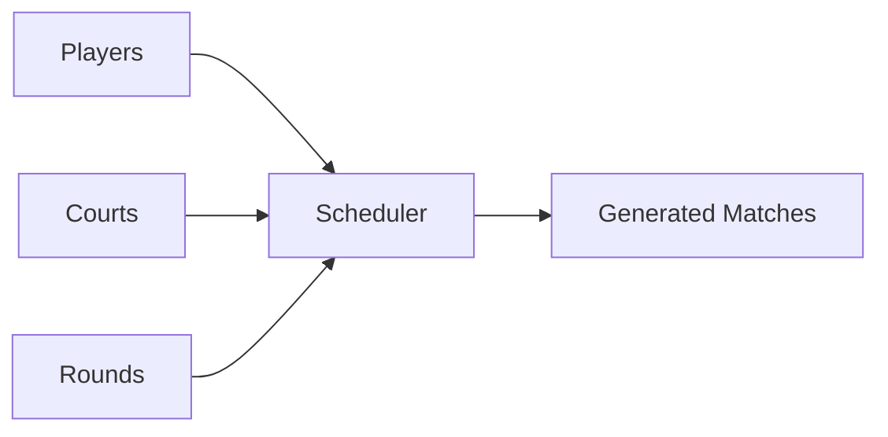
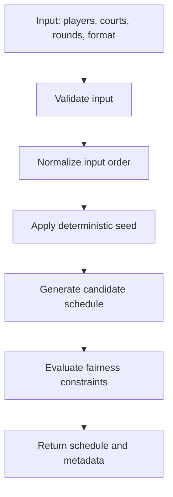
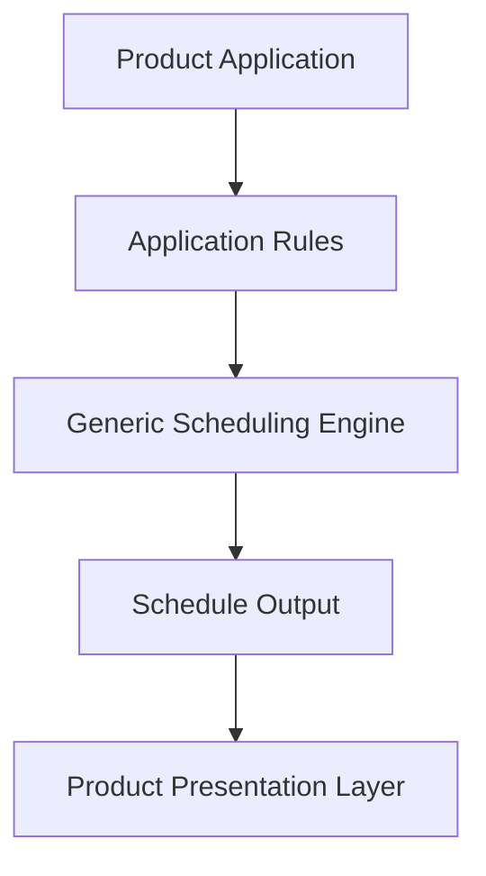

# Fair Scheduling and Deterministic Tests

> How to design scheduling algorithms that are predictable, testable, and fair enough for real-world tournament systems.

---

## Overview

Scheduling often looks like a simple algorithm problem.

Given a list of players, courts, and rounds, generate matches.

In real applications, however, scheduling becomes a system design problem.

A generated schedule must be:

- Valid
- Fair enough
- Predictable
- Explainable
- Testable
- Extensible
- Safe to integrate into a larger product

A naive scheduler may produce technically valid matches but still create poor user experience.

Examples:

```text
- One player rests too often.
- The same pair appears repeatedly.
- One player gets much stronger partners.
- Some courts are overused.
- The result changes every time without explanation.
- Edge cases break when the player count is uneven.
```

This article explains how to design scheduling logic with explicit fairness constraints and deterministic tests.

The goal is not to promise perfect fairness. The goal is to make trade-offs visible, testable, and understandable.

---

## Learning Objectives

After reading this article, you should be able to:

- Explain why tournament scheduling is more than a simple algorithm problem.
- Define fairness as measurable constraints.
- Understand why perfect fairness is often impossible.
- Design deterministic scheduling behavior.
- Separate generic algorithm logic from product-specific business rules.
- Write tests that protect scheduling behavior.
- Identify edge cases before they become production bugs.
- Explain scheduling trade-offs clearly in system design discussions.

---

## Table of Contents

1. The Problem
2. Why Scheduling Fairness Is Hard
3. Defining Fairness Constraints
4. Perfect Fairness vs Practical Fairness
5. Deterministic Scheduling
6. Separating Generic Algorithms from Product Rules
7. Testing Scheduling Behavior
8. Edge Cases
9. Trade-Offs
10. Recommended Design
11. Key Takeaways
12. Related Articles

---

# The Problem

A tournament scheduler creates matches from a set of inputs.

Typical inputs include:

```text
players
courts
rounds
format
scoring rules
constraints
```

Typical outputs include:

```text
rounds
matches
assigned players
resting players
metadata
```

At first, the problem appears straightforward.



But real scheduling systems must handle more than match generation.

They must handle expectations.

Players expect fair play time. Organizers expect predictable schedules. Developers expect repeatable tests. Product teams expect the algorithm to support future formats without rewriting the entire system.

This creates design pressure.

```text
A schedule can be valid but still feel unfair.
```

For example, a generated schedule may satisfy the basic rule that no player appears twice in the same round, but still repeat the same partners too often.

Another schedule may balance partners well but create uneven rest rounds.

Another may produce acceptable results for 8 players but fail badly for 13 players and 2 courts.

A good scheduling system needs more than a clever algorithm. It needs clear constraints, predictable behavior, and documented trade-offs.

---

# Why Scheduling Fairness Is Hard

Fairness is difficult because it is not a single rule.

It is a combination of competing constraints.

In a doubles tournament, fairness may include:

```text
- Equal number of games per player
- Equal rest distribution
- Minimal repeated partners
- Minimal repeated opponents
- Balanced court usage
- No overlapping player assignments
- Deterministic output
- Support for uneven player counts
```

These constraints can conflict.

For example:

```text
12 players
2 courts
4 players per match
```

Only 8 players can play per round, so 4 players must rest.

If the tournament has a small number of rounds, it may not be possible to give everyone the same number of games and also avoid repeated partners.

Another example:

```text
9 players
1 court
4 players per match
```

Only 4 players can play per round. Five players must rest each round. The scheduler has to rotate rest rounds, but short tournaments may still produce uneven play time.

This is why scheduling fairness should be treated as optimization under constraints, not as a guarantee of perfection.

---

# Defining Fairness Constraints

A good scheduling engine should define fairness explicitly.

Bad requirement:

```text
Make the schedule fair.
```

Better requirement:

```text
Minimize repeated partners.
Balance rest rounds.
Avoid duplicate player assignments in the same round.
Keep output deterministic for the same input.
```

Fairness constraints should be measurable.

| Constraint | Measurement |
|---|---|
| Equal play time | Number of matches per player |
| Balanced rest | Number of rest rounds per player |
| Partner variety | Count of repeated pairings |
| Opponent variety | Count of repeated opponents |
| Valid round | No player appears twice in one round |
| Court usage | Number of matches per court |
| Determinism | Same input returns same output |

When fairness is measurable, it can be tested.

When it can be tested, it can be improved safely.

---

# Perfect Fairness vs Practical Fairness

Perfect fairness is often impossible.

A scheduler may not be able to satisfy every constraint because the input itself is uneven.

Consider:

```text
13 players
2 courts
4 players per match
```

Each round can include:

```text
2 courts × 4 players = 8 active players
```

That means:

```text
13 players - 8 active players = 5 resting players per round
```

In one round, five players must rest.

Over multiple rounds, the scheduler can rotate rest assignments, but depending on the number of rounds, some players may still play more than others.

This is not always a bug. It may be a mathematical limitation of the input.

The system should therefore explain its fairness model.

A practical message is:

```text
The scheduler attempts to balance rest rounds and reduce repeated partners, but perfect fairness may not be possible for every player count, court count, and round count.
```

This is better than hiding the limitation.

---

# Deterministic Scheduling

Deterministic scheduling means the same input produces the same output.

Example:

```text
Input A + Seed 123 = Schedule X
Input A + Seed 123 = Schedule X
Input A + Seed 456 = Schedule Y
```

Determinism matters because it improves:

- Testing
- Debugging
- Reproducibility
- Documentation
- User trust
- Release safety

Without determinism, a failing test may pass on the next run for no clear reason.

Without determinism, a user may regenerate a schedule and get a completely different result without understanding why.

Without determinism, developers may struggle to debug edge cases.

If randomness is needed, it should be controlled through an explicit seed.



Important design choices:

- Sort or normalize input where appropriate.
- Accept a seed when randomization is supported.
- Return metadata explaining important scheduling decisions.
- Avoid hidden randomness.
- Avoid relying on database order without explicit sorting.

---

# Separating Generic Algorithms from Product Rules

A reusable scheduling engine should stay generic.

It should understand concepts such as:

```text
player
court
round
match
score
ranking
constraint
```

It should not know about product-specific concerns such as:

```text
subscription plan
club branding
payment status
tenant billing
mobile screen
admin dashboard
marketing campaign
```

This separation keeps the scheduling engine reusable.



The application layer can decide:

- Whether a tenant is allowed to generate more rounds
- Whether advanced formats are paid features
- Whether players can edit scores
- Whether schedules are public or private
- How results are displayed

The scheduling engine should focus on generating valid and predictable schedules.

---

# Testing Scheduling Behavior

Scheduling tests should verify behavior, not just snapshots.

Useful test categories include:

## 1. Valid Structure

Check that generated schedules have the expected structure.

```text
- Correct number of rounds
- Correct number of matches per round
- Correct number of players per match
- Valid court assignment
```

## 2. No Overlapping Players

A player should not appear twice in the same round.

```text
Round 1
- Match 1: Alice, Bob, Charlie, Dana
- Match 2: Alice, Evan, Farah, George

Invalid: Alice appears twice in Round 1.
```

## 3. Deterministic Output

The same input should return the same result.

```text
generateSchedule(input, seed) === generateSchedule(input, seed)
```

## 4. Uneven Player Counts

Test inputs where players do not divide evenly into matches.

Examples:

```text
5 players
9 players
13 players
```

## 5. Ranking Behavior

Ranking tests should verify:

```text
- Win/loss calculation
- Points for
- Points against
- Point difference
- Tie-breaking order
- Missing score handling
```

## 6. Invalid Input

The system should return clear errors for invalid input.

Examples:

```text
- Not enough players
- Invalid court count
- Invalid round count
- Duplicate player IDs
- Unsupported format
```

Good tests make algorithm behavior safe to refactor.

---

# Edge Cases

Scheduling systems should intentionally handle edge cases.

| Edge Case | Risk |
|---|---|
| Too few players | Cannot create valid matches |
| Uneven player count | Rest distribution needed |
| More courts than possible matches | Some courts unused |
| Duplicate player IDs | Invalid schedule |
| Zero rounds | Empty or invalid tournament |
| Player removed late | Schedule may need regeneration |
| Same seed with changed input | Output should change predictably |
| Missing scores | Ranking should handle incomplete data |

Edge cases should be documented because they explain the system's boundaries.

A system that clearly rejects invalid input is better than one that silently generates broken schedules.

---

# Trade-Offs

| Decision | Benefit | Trade-Off |
|---|---|---|
| Deterministic output | Easier tests and debugging | Less variety unless seed changes |
| Pure functions | Easy to test and reuse | Application must handle persistence |
| Generic interfaces | Reusable across products | Cannot use product-specific shortcuts |
| Small V1 scope | Easier to finish and explain | Advanced formats wait until later |
| Explicit constraints | Easier to reason about fairness | Requires more design effort |
| Metadata output | Improves explainability | Adds API complexity |

The right design depends on the product stage.

For an early V1 library, a small deterministic core is often better than a large flexible engine with unclear behavior.

---

# Recommended Design

A practical scheduling engine should follow these principles.

## 1. Keep the Core Pure

The scheduler should behave like a pure function.

```text
input -> schedule output
```

It should not directly depend on:

- Database state
- HTTP requests
- UI state
- Payment status
- Tenant subscription rules

This makes it easier to test and reuse.

## 2. Make Input Explicit

The scheduler should receive everything it needs.

```json
{
  "format": "americano",
  "players": [
    { "id": "p1", "name": "Alice" },
    { "id": "p2", "name": "Bob" }
  ],
  "courts": [
    { "id": "c1", "name": "Court 1" }
  ],
  "rounds": 4,
  "seed": 123
}
```

Explicit input improves reproducibility.

## 3. Return Metadata

Generated output should include useful metadata.

```json
{
  "rounds": [],
  "metadata": {
    "format": "americano",
    "playerCount": 13,
    "courtCount": 2,
    "roundCount": 4,
    "hasRestRounds": true,
    "warnings": [
      "Perfect play-time balance may not be possible with 13 players and 2 courts."
    ]
  }
}
```

Metadata helps the application explain results to users.

## 4. Keep Product Rules Outside

The product can decide whether a schedule is allowed.

The engine should decide whether a schedule can be generated.

This keeps the library clean.

---

# Key Takeaways

- Scheduling is both an algorithm problem and a system design problem.
- Fairness should be defined as measurable constraints.
- Perfect fairness is often impossible with uneven inputs.
- Deterministic behavior makes scheduling easier to test and debug.
- Randomness should use explicit seeds.
- Generic scheduling logic should not contain product-specific rules.
- Tests should verify behavior, not only snapshots.
- Edge cases should be documented and tested.
- A small deterministic V1 is better than a large unclear scheduling engine.
- Good scheduling systems make trade-offs visible.

---

# Related Articles

- [Multi-Tenant SaaS Architecture](../saas/multi-tenant-architecture.md)
- [Multi-Tenant Authentication](../authentication/multi-tenant-authentication.md)
- API Design
- Testing Strategy
- Domain Logic vs Application Logic
