# Session vs JWT Authentication

> A practical guide to choosing between session-based and token-based authentication for modern web applications, APIs, and SaaS platforms.

---

## Overview

Authentication is one of the first architectural decisions in a production application.

It affects:

- Security boundaries
- Browser behavior
- API design
- Mobile support
- Token revocation
- Session management
- Cross-origin requests
- Infrastructure complexity
- User experience

Two approaches are especially common:

1. **Session-based authentication**
2. **JSON Web Token (JWT) authentication**

Both can be secure. Both are widely used in production. Neither is automatically the best choice.

The correct decision depends on the clients the system supports, how requests are made, what security controls are required, and how much operational complexity the team is prepared to own.

This article explains how sessions and JWTs work, compares their trade-offs, and provides practical guidance for selecting an authentication strategy.

---

## Learning Objectives

After reading this article, you should be able to:

- Explain the difference between authentication and authorization.
- Describe how session-based authentication works.
- Describe how JWT-based authentication works.
- Compare the security and operational trade-offs of both approaches.
- Understand token expiration, refresh tokens, and revocation.
- Identify common implementation mistakes.
- Choose an appropriate strategy for browser applications, APIs, mobile applications, and multi-tenant SaaS platforms.

---

## Table of Contents

1. Authentication and Authorization
2. The Problem Authentication Solves
3. Core Concepts
4. Session-Based Authentication
5. JWT Authentication
6. Sessions vs JWTs
7. Browser Security Considerations
8. Token Expiration and Refresh Tokens
9. Token Revocation
10. Authentication for APIs and Mobile Applications
11. Authentication for Multi-Tenant SaaS
12. Recommended Architecture
13. Common Mistakes
14. Decision Matrix
15. Key Takeaways
16. Related Articles

---

# Authentication and Authorization

Authentication and authorization are related, but they solve different problems.

| Concept | Question Answered | Example |
|---|---|---|
| Authentication | Who are you? | Is this request really from Alice? |
| Authorization | What are you allowed to do? | Can Alice create a tournament for Club Alpha? |

A user can be authenticated without being authorized to perform a particular action.

For example, Alice may have a valid account but only be allowed to view a tournament, not edit it.

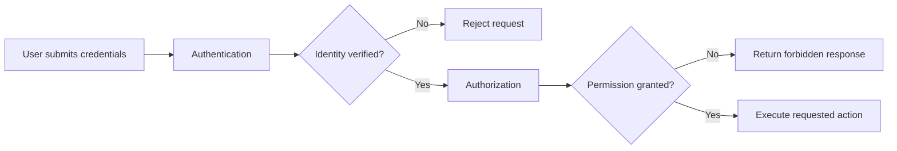

Authentication should establish identity. Authorization should then evaluate access within the relevant context, such as an organization, workspace, or tenant.

---

# The Problem Authentication Solves

HTTP is stateless.

Each request is independent from the previous request.

Without an authentication mechanism, a server cannot know whether these two requests come from the same person:

```text
GET /api/tournaments
```

```text
POST /api/tournaments
```

The application needs a secure way to associate future requests with a verified identity.

A typical login flow looks like this:

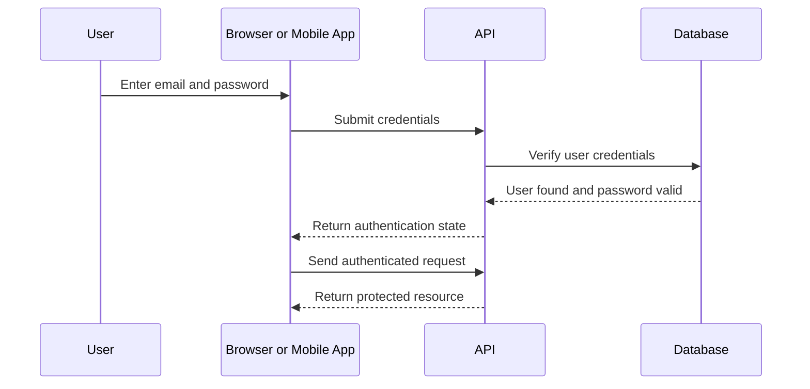

The major architectural question is:

> After login succeeds, how does the client prove its identity on every future request?

Sessions and JWTs solve this problem differently.

---

# Core Concepts

Before comparing sessions and JWTs, it helps to establish a shared vocabulary.

## Credential

A credential is information used to verify identity.

Common examples include:

- Email and password
- OAuth authorization code
- One-time password
- Security key
- Biometric verification
- API key

Credentials should only be used during the authentication process. They should never be repeatedly sent to the server after login.

---

## Authentication State

Authentication state is the information that allows the server to recognize an already authenticated user.

Examples include:

- A session identifier stored in a cookie
- A signed access token
- A refresh token
- An API key

---

## Access Token

An access token is a credential sent with requests to access protected resources.

It commonly contains, or refers to, information such as:

- User identifier
- Token expiration time
- Allowed scopes
- Issuer
- Audience

Access tokens should normally be short-lived.

---

## Refresh Token

A refresh token is a longer-lived credential used to obtain a new access token after the current access token expires.

Refresh tokens require stricter storage and handling than access tokens because they can extend a user's authenticated session.

---

## Cookie

A cookie is a small browser-managed value sent automatically with requests to the matching domain.

Cookies are commonly used to store:

- Session identifiers
- Refresh tokens
- CSRF tokens
- User preferences

Security attributes such as `HttpOnly`, `Secure`, and `SameSite` are essential when cookies carry authentication state.

---

# Session-Based Authentication

Session-based authentication stores authentication state on the server.

After a successful login, the server creates a session record and sends the browser a session identifier, usually through a cookie.

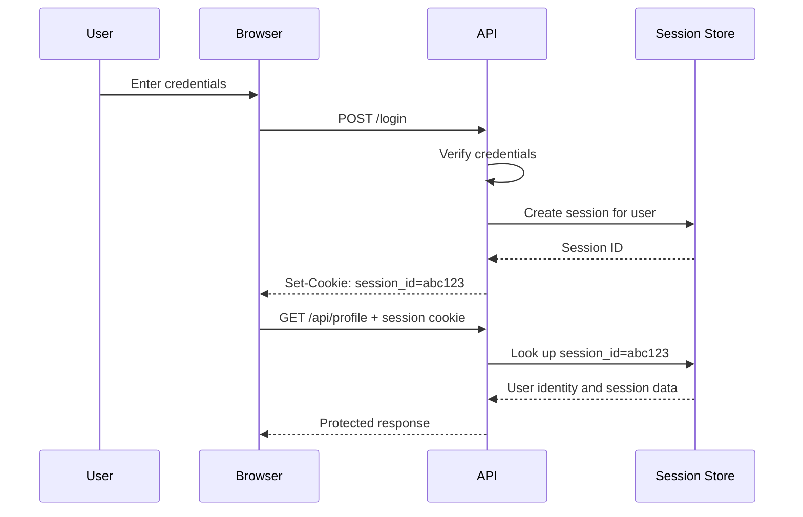

The browser stores only an opaque identifier, such as:

```text
session_id=abc123
```

The actual authentication data remains on the server.

A session record may contain:

```json
{
  "sessionId": "abc123",
  "userId": "user_42",
  "createdAt": "2026-07-03T10:00:00Z",
  "expiresAt": "2026-07-10T10:00:00Z",
  "ipAddress": "203.0.113.10",
  "userAgent": "Mozilla/5.0..."
}
```

The server receives the session ID, retrieves the session from its session store, and determines the user identity.

---

## Session Storage

Sessions should not normally be stored only in application memory.

In-memory sessions create problems when:

- The application restarts.
- Multiple application instances are deployed.
- Traffic is distributed through a load balancer.
- A user request reaches a different server than the original login request.

A shared session store is the common solution.

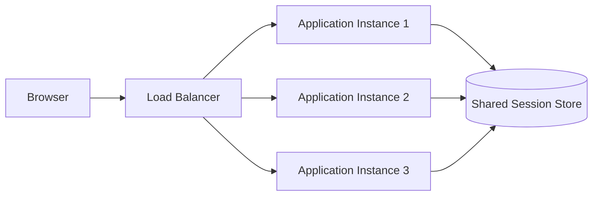

Redis is frequently used as a session store because it offers fast reads, expiration support, and shared access across application instances.

---

## Advantages of Sessions

### Server-Controlled Revocation

Because the server owns session state, it can revoke a session immediately.

Examples include:

- User logout
- Password change
- Suspicious login detection
- Account suspension
- Device removal

The server simply deletes or invalidates the session record.

---

### Minimal Sensitive Data in the Client

The browser stores only an opaque session identifier.

User roles, permissions, and internal metadata do not need to be visible in the client.

---

### Natural Fit for Traditional Web Applications

Sessions work especially well when:

- The application is browser-first.
- Frontend and backend share the same top-level domain.
- The backend renders pages or provides a same-origin API.
- Cookie handling is acceptable.

---

## Disadvantages of Sessions

### Stateful Infrastructure

The server must store and retrieve session data.

This introduces a dependency on a session store such as Redis or a database.

---

### Cross-Origin Complexity

Cookies are governed by browser security rules.

Applications with separate frontend and backend domains must configure:

- CORS
- Cookie domain rules
- `SameSite`
- `Secure`
- Credentialed requests

incorrectly configured cross-origin cookies can cause both security and usability issues.

---

### CSRF Considerations

Because browsers automatically send cookies, session-based authentication can be vulnerable to Cross-Site Request Forgery (CSRF) if the application does not use appropriate protections.

This does not make sessions unsafe. It means CSRF protections are a required part of the design.

---

# JWT Authentication

JSON Web Tokens (JWTs) are a token-based approach to authentication.

After a successful login, the server creates a signed token and returns it to the client. The client sends that token with future requests, typically through the `Authorization` header.

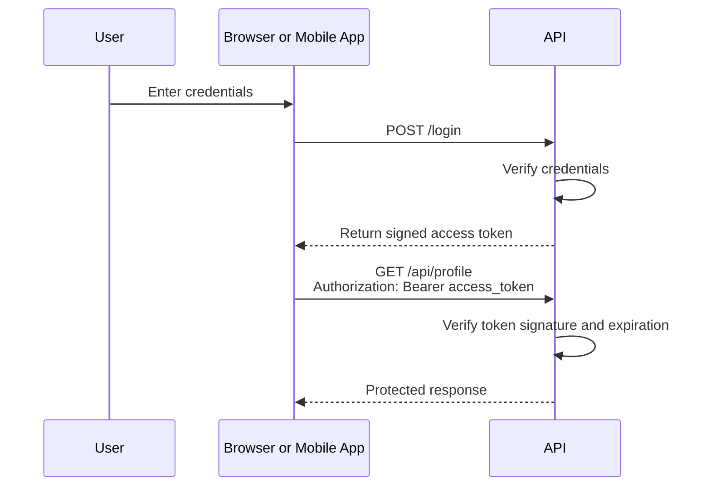

A JWT commonly looks like this:

```text
eyJhbGciOiJIUzI1NiIsInR5cCI6IkpXVCJ9
.
eyJzdWIiOiJ1c2VyXzQyIiwicm9sZSI6ImFkbWluIiwiZXhwIjoxNz...
.
signature
```

Although a JWT looks opaque, it is usually only Base64URL-encoded. It should not contain secrets that must remain hidden from the client.

A signed JWT has three parts:

```text
header.payload.signature
```

| Part | Purpose |
|---|---|
| Header | Declares token metadata, including the signing algorithm. |
| Payload | Contains claims such as user ID, issuer, audience, and expiration. |
| Signature | Allows the server to detect token tampering. |

A typical payload might look like this:

```json
{
  "sub": "user_42",
  "iss": "https://api.example.com",
  "aud": "racket-hub-client",
  "iat": 1783072800,
  "exp": 1783073700,
  "scope": ["tournaments:read", "tournaments:write"]
}
```

The API verifies the signature before trusting any claim inside the token.

If an attacker changes:

```json
{
  "sub": "user_42"
}
```

to:

```json
{
  "sub": "admin_1"
}
```

the signature validation fails because the token contents no longer match the original signature.

---

## Stateless Verification

The most important characteristic of JWT authentication is that the API can often validate a token without querying a session store.

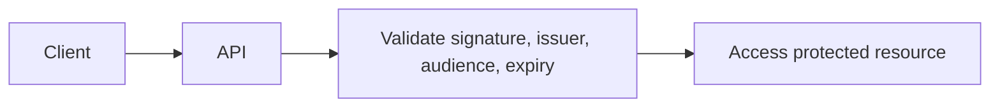

This is commonly described as **stateless authentication**.

The server validates:

- The token signature
- The signing algorithm
- The issuer
- The audience
- The expiration time
- Optional claims, such as scopes or token type

The server does not need to retrieve a session record for every request.

This can simplify horizontal scaling, especially for APIs serving mobile apps, third-party integrations, or multiple backend services.

However, "stateless" does not mean "no state exists anywhere in the system."

Production JWT systems often still require server-side state for:

- Refresh token rotation
- Token revocation
- Device management
- Suspicious-login detection
- Logout from all devices
- Audit records
- Session history

---

## Access Tokens

An access token is used to access protected APIs.

It should be short-lived.

Typical lifetimes include:

| Client Type | Typical Access Token Lifetime |
|---|---:|
| Browser application | 5–15 minutes |
| Mobile application | 5–30 minutes |
| Service-to-service API | 5–60 minutes |
| Command-line tool | Depends on risk and reauthentication requirements |

Short expiration limits the damage if an access token is stolen.

For example, if a token is valid for 10 minutes, an attacker has a limited window in which to use it.

Long-lived access tokens increase risk because they remain useful for longer after compromise.

---

## Where Should a JWT Be Stored?

This is one of the most important JWT design decisions.

### Option 1: Browser Memory

The token exists only in the running JavaScript application.

```text
JavaScript memory
```

#### Advantages

- Not persisted after a full page refresh.
- Less exposed to persistent browser storage theft.
- Works naturally with `Authorization` headers.

#### Disadvantages

- Lost when the page is refreshed.
- Requires a refresh flow or reauthentication.
- Still vulnerable to token theft if malicious JavaScript executes in the page.

---

### Option 2: `localStorage`

The token is stored in browser local storage.

```text
localStorage.access_token
```

#### Advantages

- Survives page refreshes.
- Easy to implement.
- Common in simple tutorials.

#### Disadvantages

- Accessible to JavaScript.
- Vulnerable to token theft through Cross-Site Scripting (XSS).
- Difficult to protect if the application has an XSS vulnerability.

For most production browser applications, storing long-lived authentication tokens in `localStorage` is not recommended.

---

### Option 3: `sessionStorage`

The token is stored only for the browser tab session.

```text
sessionStorage.access_token
```

#### Advantages

- Cleared when the browser tab is closed.
- Less persistent than `localStorage`.

#### Disadvantages

- Still accessible to JavaScript.
- Still vulnerable to XSS.
- Does not solve the fundamental browser-token theft risk.

---

### Option 4: Secure, HttpOnly Cookie

The token is stored in a cookie that JavaScript cannot read.

```http
Set-Cookie: refresh_token=...; HttpOnly; Secure; SameSite=Lax
```

#### Advantages

- JavaScript cannot directly read the token.
- Reduces the impact of many XSS token-theft attacks.
- Browser sends the token automatically when configured correctly.

#### Disadvantages

- Requires careful CSRF protection.
- Requires cookie and cross-origin configuration.
- Can make API clients slightly more complex.

For browser-based SaaS applications, a common production pattern is:

- Keep the access token in memory.
- Store a longer-lived refresh token in a secure, HttpOnly cookie.
- Use the refresh token to obtain a new access token when needed.

This approach attempts to reduce both long-lived token exposure and unnecessary user reauthentication.

---

## Advantages of JWT Authentication

### Good Fit for APIs and Mobile Clients

JWTs work naturally with APIs because clients can send them through headers.

```http
Authorization: Bearer <access-token>
```

This pattern is especially suitable for:

- Mobile applications
- Single-page applications
- Third-party integrations
- Service-to-service communication
- Command-line tools

---

### Easier Stateless Scaling

Because application instances can verify signed tokens independently, they do not always need to query a shared session store.

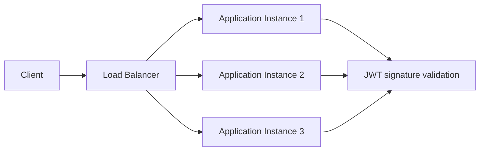

This can reduce dependency on a session database for routine access-token validation.

---

### Supports Delegated and Service Authentication

JWTs are frequently used in OAuth 2.0 and OpenID Connect flows.

They are also useful when one backend service calls another backend service and needs to carry authenticated identity or scoped permissions.

---

## Disadvantages of JWT Authentication

### Revocation Is More Difficult

A valid JWT remains valid until it expires unless the system introduces additional server-side checks.

For example, if a user logs out, a previously issued access token may still work until expiration.

This is why short-lived access tokens are important.

Immediate revocation often requires one of these strategies:

- A token denylist
- A session or token registry
- Token versioning
- Short access-token lifetimes
- Refresh-token revocation

Each approach reintroduces some server-side state and operational complexity.

---

### Claims Can Become Stale

JWTs may contain claims such as:

- Role
- Subscription plan
- Tenant membership
- Permissions

These claims remain unchanged until the token expires.

Suppose a user is removed from an organization at 10:00.

If their JWT contains organization access until 10:15, they may retain access until the token expires unless the API performs additional server-side validation.

For this reason, avoid placing rapidly changing authorization state inside long-lived access tokens.

---

### Token Size Can Increase Request Cost

JWTs are larger than opaque session IDs.

A typical session cookie might be:

```text
session_id=abc123
```

A JWT can be hundreds or thousands of bytes, especially when it contains many claims.

Sending large tokens on every request increases bandwidth use and can affect performance at high volume.

---

# Sessions vs JWTs

Sessions and JWTs solve the same core problem: associating future requests with an authenticated identity.

They differ mainly in where authentication state is stored and how the API validates it.

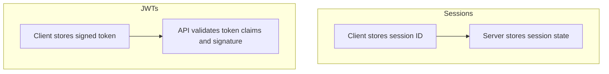

## Comparison

| Concern | Session-Based Authentication | JWT Authentication |
|---|---|---|
| Primary state location | Server-side session store | Client-held signed token |
| Request validation | Look up session record | Verify token signature and claims |
| Immediate logout/revocation | Straightforward | Requires additional design |
| Horizontal scaling | Shared session store required | Often works without session lookup |
| Browser support | Excellent with secure cookies | Good, but storage choice is critical |
| CSRF risk | Must be managed for cookie auth | Depends on token transport |
| XSS token theft risk | Lower with HttpOnly cookies | High if stored in `localStorage` |
| Mobile API support | Possible, but less natural | Excellent |
| Token claim freshness | Server state is current | Claims may become stale |
| Operational complexity | Session store required | Refresh, rotation, and revocation require careful design |

The comparison is not "old versus modern."

Sessions are not outdated. JWTs are not automatically more secure.

The best choice depends on the application architecture and threat model.

---

# Browser Security Considerations

Authentication design for browser applications must account for two important threats:

1. Cross-Site Scripting (XSS)
2. Cross-Site Request Forgery (CSRF)

## Cross-Site Scripting

XSS occurs when an attacker causes malicious JavaScript to run inside a trusted application page.

If access tokens are stored in `localStorage`, malicious JavaScript can often read and exfiltrate them.

```javascript
const token = localStorage.getItem("access_token");
```

Using HttpOnly cookies prevents JavaScript from directly reading the cookie value.

However, HttpOnly cookies do not eliminate the broader impact of XSS. Malicious scripts may still perform actions through the victim's authenticated browser session.

Preventing XSS requires defense in depth:

- Escape untrusted content.
- Use a strong Content Security Policy.
- Avoid unsafe HTML rendering.
- Validate and sanitize rich text.
- Keep dependencies updated.
- Review third-party scripts.

---

## Cross-Site Request Forgery

CSRF occurs when a browser automatically sends authentication cookies with a malicious cross-site request.

For example, an attacker may try to cause a logged-in user to submit a request to a trusted application.

Cookie-based authentication should include CSRF protections such as:

- `SameSite=Lax` or `SameSite=Strict` where compatible.
- Anti-CSRF tokens for state-changing requests.
- Origin and referer validation.
- Explicit CORS configuration.
- Avoiding broad cross-origin credential support.

JWTs sent in an `Authorization` header are not automatically attached by browsers in the same way as cookies, which changes the CSRF threat model.

However, JWTs stored in JavaScript-readable browser storage increase XSS exposure.

The objective is not to eliminate every risk with one mechanism. It is to choose a design that applies appropriate protection at every layer.

---

# Token Expiration and Refresh Tokens

Access tokens should be short-lived.

A short expiration reduces the amount of time an attacker can use a stolen token.

For example:

```text
Access Token Lifetime: 15 minutes
Refresh Token Lifetime: 30 days
```

When the access token expires, the client uses a refresh token to request a new access token.

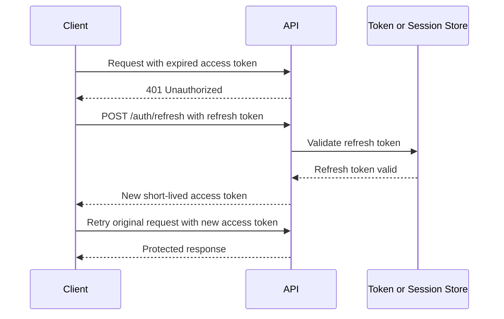

This design separates two concerns:

- The access token is used frequently and should expire quickly.
- The refresh token is used less frequently and should be protected more carefully.

---

## Refresh Token Rotation

A production system should generally rotate refresh tokens.

When a client exchanges a refresh token for a new access token, the server should:

1. Validate the existing refresh token.
2. Invalidate the existing refresh token.
3. Create a replacement refresh token.
4. Return the new access token and replacement refresh token.

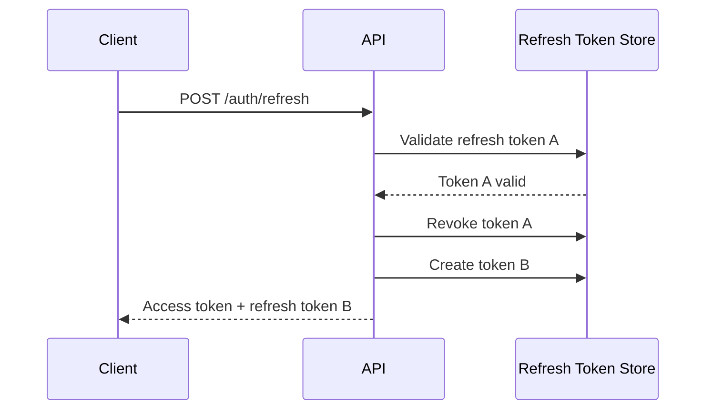

Rotation reduces the usefulness of a stolen refresh token.

If an attacker uses an already-rotated refresh token, the server can treat this as a possible compromise and revoke the token family or all active sessions for that user.

---

## Refresh Token Storage

Refresh tokens should be stored more carefully than access tokens because they can create new access tokens.

For browser applications, a common pattern is:

```http
Set-Cookie: refresh_token=...; HttpOnly; Secure; SameSite=Lax; Path=/auth/refresh
```

Important attributes include:

| Attribute | Purpose |
|---|---|
| `HttpOnly` | Prevents JavaScript from reading the token. |
| `Secure` | Sends the cookie only over HTTPS. |
| `SameSite` | Reduces some cross-site request risks. |
| `Path` | Limits where the browser sends the cookie. |
| `Max-Age` or `Expires` | Defines token lifetime. |

For mobile applications, refresh tokens are usually stored in platform-provided secure storage, such as:

- iOS Keychain
- Android Keystore
- Secure storage libraries provided by the mobile framework

Refresh tokens should never be stored in plaintext application files, logs, analytics events, or database columns without appropriate protection.

---

# Token Revocation

Revocation answers this question:

> How can the system invalidate authentication state before it naturally expires?

This matters when:

- A user logs out.
- A password changes.
- A user account is suspended.
- A device is lost.
- A refresh token is suspected to be compromised.
- An administrator removes a user from an organization.

Session-based authentication handles revocation naturally because the server can delete the corresponding session record.

JWT-based systems need an explicit strategy.

---

## Session Revocation

For sessions, revocation is straightforward.

```text
Delete session record

session_id=abc123
```

The next request includes the old session cookie, but the server cannot find a matching active session.

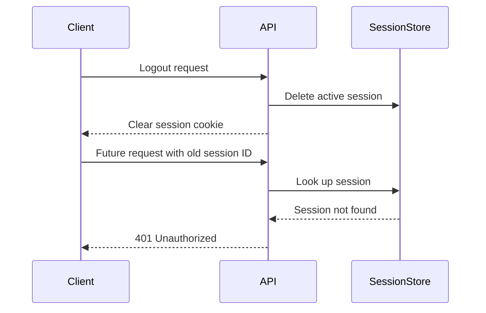

---

## JWT Revocation Strategies

JWT revocation is more complex because the API may validate access tokens without querying a central store.

Common approaches include the following.

### Short-Lived Access Tokens

This is the simplest and most common strategy.

If access tokens expire in 5 to 15 minutes, a compromised token has limited usefulness.

This does not provide immediate revocation, but it keeps the risk window small.

---

### Refresh Token Revocation

The server stores refresh tokens or refresh-token metadata.

When a user logs out, changes password, or is suspended, the server revokes the associated refresh tokens.

The current access token may remain valid until expiration, but the client cannot obtain a new one.

This is often enough for normal SaaS applications.

---

### Token Denylist

The system stores revoked access-token identifiers until their expiration time.

The API checks the denylist during token validation.

```text
JWT request
    ↓
Validate signature
    ↓
Check token ID against denylist
    ↓
Allow or reject request
```

This enables immediate revocation but adds a storage lookup to every request, reducing the main benefit of fully stateless validation.

---

### Token Versioning

The user record contains a token version.

```json
{
  "userId": "user_42",
  "tokenVersion": 3
}
```

The JWT includes the same version.

```json
{
  "sub": "user_42",
  "tokenVersion": 3
}
```

When the user logs out from all devices or changes password, the server increments the stored token version.

Any token with an older version becomes invalid.

This approach requires a user lookup or cache lookup during validation, but it can be simpler than tracking every individual token.

---

# Authentication for APIs and Mobile Applications

Authentication strategy should account for the type of client using the system.

A browser-first application and a mobile application have different requirements.

---

## Browser Applications

For browser applications, the most important risks are generally:

- XSS
- CSRF
- Cross-origin configuration mistakes
- Long-lived token exposure

Two common production patterns are:

### Pattern A: Server-Side Sessions with Secure Cookies

```text
Browser
    ↓
Secure HttpOnly session cookie
    ↓
Backend API
    ↓
Redis or session store
```

This is often a strong choice when:

- The frontend and backend are same-origin or closely integrated.
- The product is primarily browser-based.
- Immediate logout and revocation are important.
- The team wants simple server-controlled session management.

---

### Pattern B: Short-Lived Access Token + HttpOnly Refresh Cookie

```text
Browser memory
    ↓
Short-lived access token
    ↓
Authorization header
    ↓
Backend API

HttpOnly cookie
    ↓
Refresh token
    ↓
POST /auth/refresh
```

This is often appropriate when:

- The frontend is a separate single-page application.
- The API may later support mobile clients.
- The team needs explicit access-token handling.
- The application uses OAuth 2.0 or OpenID Connect patterns.

The browser must still use CSRF protections for refresh-token endpoints when cookies are involved.

---

## Mobile Applications

Mobile applications usually interact with APIs through bearer tokens.

A common design is:

```text
Mobile App
    ↓
Short-lived access token
    ↓
Authorization header
    ↓
API

Secure device storage
    ↓
Refresh token
```

Mobile clients should use platform-provided secure storage rather than plain application storage.

They also need a strategy for:

- Device logout
- Token refresh
- Offline behavior
- Lost devices
- Account switching

JWT-style access tokens are often a natural fit here because mobile applications commonly communicate with APIs rather than server-rendered pages.

---

## Service-to-Service Communication

Backend services should generally not use end-user browser sessions.

Instead, common options include:

- OAuth 2.0 client credentials
- Signed JWT service tokens
- Mutual TLS
- API keys with rotation
- Workload identity provided by cloud infrastructure

Service tokens should include only the minimum scopes required.

```json
{
  "sub": "notification-service",
  "aud": "user-service",
  "scope": ["users:read"]
}
```

Avoid reusing an end-user access token as the default identity mechanism for unrelated background services.

---

# Authentication for Multi-Tenant SaaS

Multi-tenant SaaS adds an additional dimension to authentication.

A system must determine:

1. Who is the user?
2. Which tenant is currently active?
3. Is the user a member of that tenant?
4. What is the user allowed to do within that tenant?

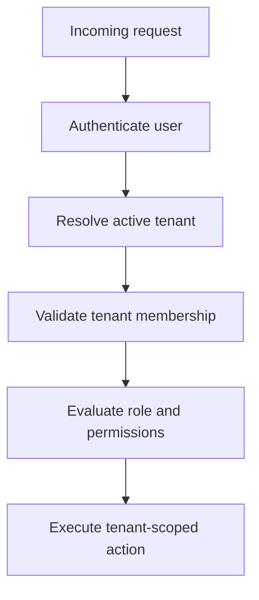

Authentication alone is not enough.

A valid user token should not automatically grant access to every tenant in the system.

---

## User Identity vs Tenant Context

A user identity and tenant context should be treated as separate concepts.

For example:

```text
Authenticated user: Alice
Active tenant: Club Alpha
Role: Tournament Admin
```

Alice may also belong to another tenant:

```text
Authenticated user: Alice
Active tenant: Club Bravo
Role: Player
```

The user is the same, but authorization differs because the active tenant differs.

---

## Tenant Context Sources

The active tenant can be resolved through:

- Subdomain
- Custom domain
- URL path
- Organization selector
- JWT claim
- Server-side session state

Examples:

```text
club-alpha.example.com
```

```text
example.com/organizations/club-alpha
```

```json
{
  "sub": "user_42",
  "activeTenantId": "club-alpha"
}
```

The important rule is:

> The server must validate that the authenticated user actually belongs to the resolved tenant.

Never assume that a client-provided tenant identifier is valid merely because the user has a valid token.

---

## Tenant Claims in JWTs

Including a tenant ID in a JWT can be useful, but it should be used carefully.

Example:

```json
{
  "sub": "user_42",
  "tenantId": "club-alpha",
  "role": "admin",
  "exp": 1783073700
}
```

This may work well when:

- The user has one active tenant at a time.
- Tokens are short-lived.
- Tenant switching issues a new token.
- The application validates membership where required.

It becomes more problematic when:

- A user belongs to many tenants.
- Roles change frequently.
- Membership can be revoked immediately.
- Tokens have long expiration times.

In those cases, tenant membership and authorization should usually be validated against server-side data or a short-lived cache.

---

# Recommended Architecture

There is no universal authentication architecture.

However, a practical production-oriented approach for a modern SaaS platform is:

```text
Browser client:
- Short-lived access token in memory
- Refresh token in Secure, HttpOnly cookie
- Refresh token rotation
- CSRF protection for refresh endpoints

Mobile client:
- Short-lived access token
- Refresh token in platform secure storage
- Refresh token rotation

Backend:
- Central identity and authentication service
- Refresh-token registry or session store
- Tenant membership validation
- Role and permission evaluation
- Audit logging for important authentication events
```

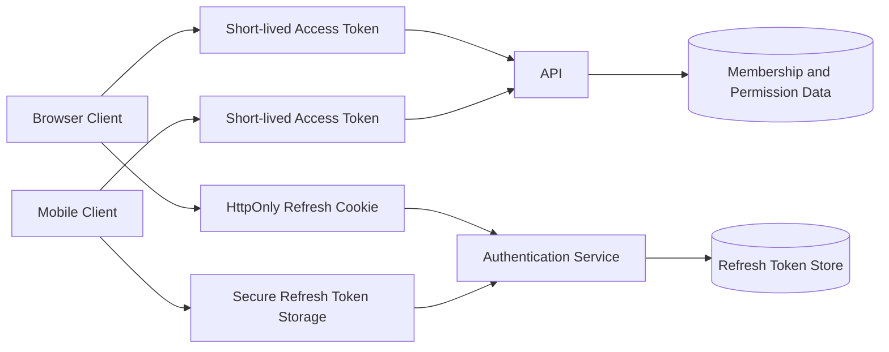

This approach provides:

- Short exposure windows for access tokens
- Controlled refresh-token revocation
- Better browser protection than persistent JavaScript-readable token storage
- A clear path for mobile support
- Tenant-aware authorization
- Flexible future integration with OAuth 2.0 or OpenID Connect

It is not the only valid design, but it is a strong default for many SaaS applications.

---

# Common Mistakes

## Storing Long-Lived Tokens in `localStorage`

This increases the impact of XSS vulnerabilities.

Prefer short-lived in-memory access tokens and HttpOnly refresh cookies for browser applications where appropriate.

---

## Using Long-Lived Access Tokens

Access tokens should not remain valid for days or months.

Long-lived access tokens increase the damage caused by token theft.

---

## Putting Too Much Authorization Data in JWT Claims

Roles, subscription plans, permissions, and tenant memberships can change.

Long-lived tokens with embedded authorization data can become stale.

Keep access tokens short-lived and validate critical authorization decisions server-side.

---

## Treating Logout as a Client-Only Operation

Deleting a token from the browser does not necessarily invalidate it.

Logout should revoke or invalidate refresh tokens and server-side sessions.

---

## Ignoring CSRF Because the Application Uses JWTs

JWTs do not automatically eliminate CSRF risk.

If JWTs or refresh tokens are stored in cookies, CSRF protections are still required.

---

## Using `alg: none` or Weak JWT Validation

JWT validation must explicitly enforce:

- Accepted signing algorithms
- Token issuer
- Token audience
- Expiration time
- Not-before time where applicable
- Signature validity

Never trust a decoded token before validating it.

---

## Using One Shared Secret Everywhere

Secrets used to sign tokens should be protected, rotated, and scoped appropriately.

For larger systems, asymmetric signing keys can simplify public-key verification across services.

---

## Forgetting Device and Session Management

Users expect to be able to:

- Log out from all devices
- Review active sessions
- Remove lost devices
- Revoke suspicious sessions

Design these capabilities early rather than treating them as a later add-on.

---

# Decision Matrix

| Situation | Recommended Starting Point |
|---|---|
| Traditional server-rendered web application | Server-side sessions with secure cookies |
| Same-origin browser SaaS application | Sessions or short-lived access token plus HttpOnly refresh cookie |
| Single-page application with separate API | Short-lived access token plus secure refresh-token flow |
| Mobile application | Short-lived bearer access token plus refresh token in secure device storage |
| Third-party API | OAuth 2.0 or scoped API keys |
| Service-to-service communication | Client credentials, service JWTs, mTLS, or workload identity |
| Multi-tenant SaaS | Authentication plus explicit tenant membership and permission validation |
| High immediate-revocation requirement | Server-side sessions or JWTs backed by revocation state |

---

# Key Takeaways

- Authentication proves identity; authorization determines allowed actions.
- Sessions and JWTs are both valid production approaches.
- Sessions keep authentication state on the server and make revocation straightforward.
- JWTs support API-first and mobile-first architectures well, but revocation and stale claims require careful design.
- Browser token storage decisions are security decisions.
- Avoid storing long-lived authentication tokens in JavaScript-readable browser storage.
- Access tokens should usually be short-lived.
- Refresh tokens should be protected, rotated, and revocable.
- Multi-tenant SaaS requires authentication, tenant resolution, membership validation, and authorization.
- Choose the simplest architecture that satisfies the product's real client, security, and operational requirements.

---

# Related Articles

- [Multi-Tenant SaaS Architecture](../saas/multi-tenant-architecture.md)
- Authentication Overview
- Refresh Token Rotation
- OAuth 2.0
- OpenID Connect
- Role-Based Access Control
- Multi-Tenant Authentication
- API Security
- Row Level Security
- Rate Limiting
