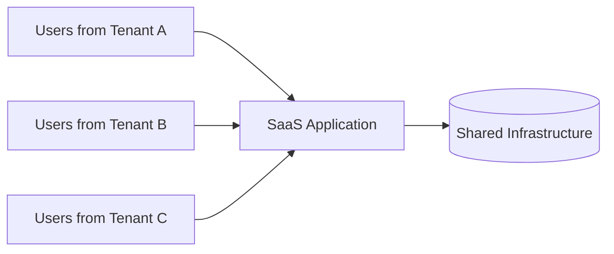
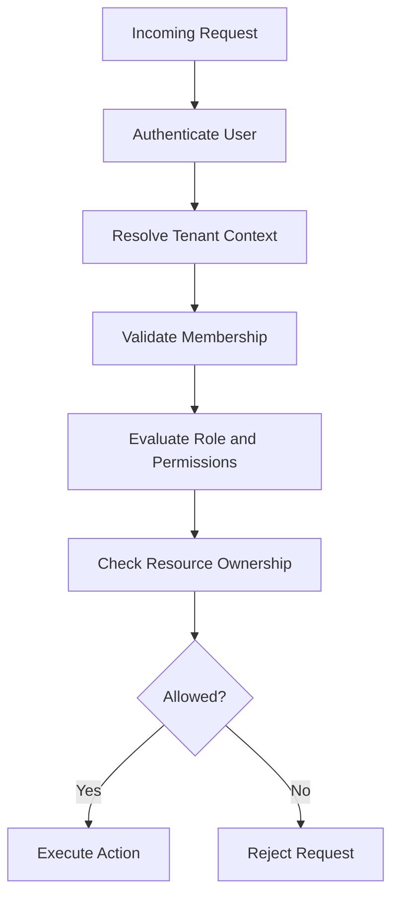
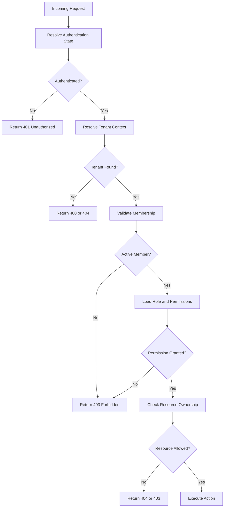
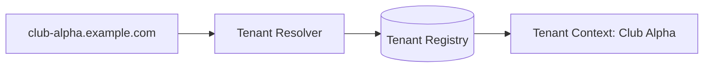
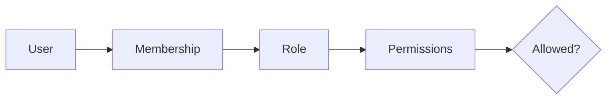
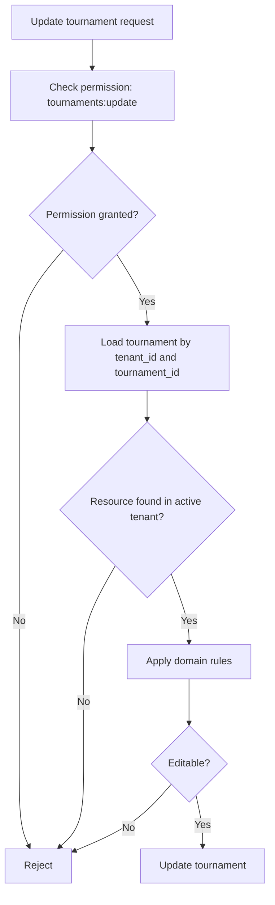
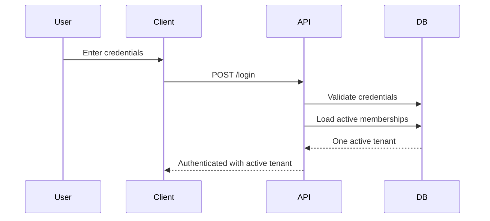
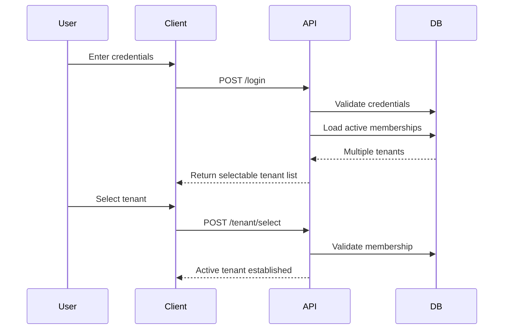
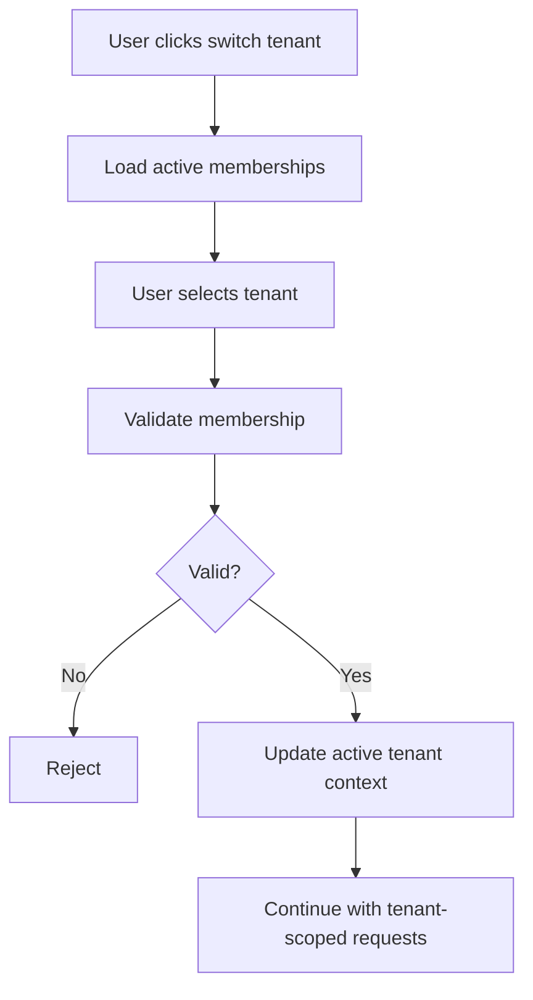
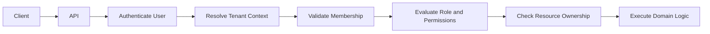

# Multi-Tenant Authentication

> How authentication, tenant context, membership validation, and authorization work together in SaaS applications.

---

## Overview

Authentication becomes more complex in a multi-tenant SaaS application.

In a simple single-tenant application, authentication usually answers one question:

```text
Who is the user?
```

In a multi-tenant SaaS application, that is not enough.

The system must also answer:

```text
Which tenant is the user trying to access?
Is the user a member of that tenant?
What role does the user have in that tenant?
Can the user access this specific resource?
```

A user may be valid in the system but not allowed to access every tenant.

For example:

```text
Alice is authenticated.

Alice belongs to:
- Club Alpha as Admin
- Club Bravo as Player

Alice does not belong to:
- Club Gamma
```

Authentication proves that the request is from Alice.

It does not automatically prove that Alice can access Club Gamma, manage billing for Club Bravo, or update tournaments in Club Alpha.

That distinction is the foundation of multi-tenant authentication and authorization.

This article explains how production SaaS applications combine authentication, tenant resolution, membership validation, role-based access control, and resource ownership checks to protect tenant data.

---

## Learning Objectives

After reading this article, you should be able to:

- Explain why authentication alone is not enough in multi-tenant SaaS.
- Understand the difference between user identity and tenant context.
- Design a safe request flow for tenant-scoped APIs.
- Validate tenant membership before accessing tenant-owned resources.
- Understand how RBAC fits into multi-tenant authentication.
- Decide what tenant information should or should not be stored in tokens.
- Support users who belong to multiple tenants.
- Avoid common cross-tenant access-control mistakes.

---

## Table of Contents

1. The Problem
2. Authentication Is Not Tenant Access
3. Core Concepts
4. Request Flow
5. Tenant Resolution
6. Membership Validation
7. Role and Permission Evaluation
8. Resource Ownership Checks
9. Token Claims and Tenant Context
10. Session-Based Tenant Context
11. Multi-Tenant Login Flows
12. Tenant Switching
13. Security Best Practices
14. Common Mistakes
15. Decision Matrix
16. Recommended Architecture
17. Key Takeaways
18. Related Articles

---

# The Problem

Multi-tenant SaaS applications serve many customers from the same platform.

Each customer is usually represented as a tenant, organization, workspace, account, or club.



The application must allow each tenant to use the platform independently while preventing cross-tenant data access.

That means the authentication system must do more than verify login credentials.

It must help enforce tenant boundaries.

Consider this request:

```http
GET /api/tournaments
Authorization: Bearer <access-token>
```

The access token may prove that the request is from Alice.

But the API still needs to know:

```text
Which tenant's tournaments should Alice see?
```

If Alice belongs to multiple tenants, the answer is not obvious.

```text
Alice
├── Club Alpha
├── Club Bravo
└── Club Delta
```

The API must establish an active tenant context before returning tenant-owned data.

Without that context, the application risks:

- Returning data from the wrong tenant
- Applying the wrong role
- Using incorrect cache keys
- Writing records under the wrong tenant
- Creating audit logs without enough context
- Allowing users to access tenants they do not belong to

This is why multi-tenant authentication should be designed as a flow, not as a single login check.

---

# Authentication Is Not Tenant Access

Authentication answers:

```text
Who is making this request?
```

Tenant access answers:

```text
Which tenant can this user access?
```

Authorization answers:

```text
What can this user do inside that tenant?
```

These are related, but they are not the same.

| Step | Question | Example |
|---|---|---|
| Authentication | Who is the user? | Alice |
| Tenant Resolution | Which tenant is active? | Club Alpha |
| Membership Validation | Does Alice belong to Club Alpha? | Yes |
| Authorization | What can Alice do in Club Alpha? | Manage tournaments |
| Resource Ownership | Does this resource belong to Club Alpha? | Yes |

A secure SaaS request should pass through all of these checks before performing sensitive actions.



Skipping any step weakens the tenant boundary.

For example, checking only authentication may allow Alice to access data from tenants she does not belong to.

Checking only RBAC may allow Alice's role from one tenant to be accidentally applied to another tenant.

Checking only tenant ownership without membership validation may allow invalid users to interact with tenant resources.

A production system should treat these checks as separate layers.

---

# Core Concepts

## User Identity

User identity represents the authenticated person or system making the request.

Examples:

```text
user_123
alice@example.com
```

User identity usually comes from:

- Session lookup
- JWT access token
- OAuth identity provider
- API key
- Service credential

The identity should be established before tenant-specific authorization occurs.

---

## Tenant

A tenant is the organization-level boundary inside the SaaS application.

Examples:

- Company
- Workspace
- Club
- School
- Store
- Department

A tenant owns business data.

```text
Tenant
├── Members
├── Roles
├── Players
├── Tournaments
├── Courts
└── Settings
```

---

## Tenant Context

Tenant context is the active tenant for the current request.

Example:

```text
Authenticated user: Alice
Active tenant: Club Alpha
```

Tenant context should be established early in the request lifecycle and passed consistently to application services, repositories, background jobs, events, logs, and audit records.

A request without tenant context should not be allowed to access tenant-owned resources.

---

## Membership

Membership connects a user to a tenant.

```text
Alice → Club Alpha
Bob → Club Alpha
Charlie → Club Bravo
```

A membership usually contains:

- User ID
- Tenant ID
- Role
- Status
- Join date
- Invitation state

Example:

```json
{
  "userId": "user_123",
  "tenantId": "tenant_alpha",
  "role": "admin",
  "status": "active"
}
```

A user should only access a tenant when they have an active membership.

---

## Role

A role describes a user's responsibility inside a tenant.

Examples:

```text
Owner
Admin
Manager
Coach
Player
Viewer
```

Roles should be scoped to the tenant membership, not globally assigned to the user.

This is unsafe:

```text
Alice → Admin
```

This is safer:

```text
Alice → Club Alpha → Admin
Alice → Club Bravo → Player
```

---

## Permission

A permission is a specific capability.

Examples:

```text
tournaments:read
tournaments:create
tournaments:update
players:manage
memberships:invite
billing:manage
```

Roles group permissions together.

The application checks whether the user's role in the active tenant grants the required permission.

---

## Resource Ownership

Resource ownership verifies that the specific object being accessed belongs to the active tenant.

For example, even if Alice has permission to update tournaments, the system must still verify that the tournament belongs to Club Alpha.

```text
Tournament ID: tournament_123
Tenant ID on resource: Club Alpha
Active tenant context: Club Alpha
Decision: allowed to continue
```

If the resource belongs to another tenant, the request should be rejected.

---

# Request Flow

A production multi-tenant authentication flow should be explicit and consistent.



Each step narrows the request from a general authenticated identity into a tenant-scoped authorized action.

---

## 401 vs 403 vs 404

Multi-tenant APIs should use response codes carefully.

| Status | Meaning | Example |
|---|---|---|
| `401 Unauthorized` | Authentication is missing or invalid. | No valid session or token. |
| `403 Forbidden` | User is authenticated but not allowed. | User is not a member of the tenant. |
| `404 Not Found` | Resource does not exist in this context. | Tournament is not found within the active tenant. |

For cross-tenant resource access, returning `404 Not Found` is often safer than returning `403 Forbidden`, because it avoids confirming that another tenant's resource exists.

The exact convention can vary, but it should be consistent across the API.

---

# Tenant Resolution

Tenant resolution determines the active tenant for a request.

Common strategies include:

- Subdomain
- Custom domain
- URL path
- Selected organization stored in session state
- Short-lived token claim
- Internal service metadata

---

## Subdomain Resolution

Example:

```text
https://club-alpha.example.com
```

The application extracts `club-alpha` from the hostname and maps it to a tenant record.



Subdomains are common for B2B SaaS because they provide clean tenant-specific URLs.

---

## Custom Domain Resolution

Example:

```text
https://portal.clubalpha.com
```

The application maps the custom domain to a tenant.

This is useful for white-label or enterprise SaaS.

It requires additional operational work:

- Domain verification
- DNS configuration
- SSL certificate management
- Domain ownership validation
- Renewal and failure handling

---

## URL Path Resolution

Example:

```text
https://example.com/orgs/club-alpha/tournaments
```

This is simpler to implement and useful for MVPs or internal tools.

However, it may be less polished for customer-facing SaaS and can become awkward if the product later supports custom domains.

---

## Session-Based Tenant Selection

After login, the user selects an active tenant.

The server stores the active tenant in session state.

```text
Session:
- userId: user_123
- activeTenantId: tenant_alpha
```

This works well when using server-side sessions.

The server should still validate that the user remains an active member of the tenant.

---

## Token-Based Tenant Selection

A short-lived access token may include the active tenant.

```json
{
  "sub": "user_123",
  "activeTenantId": "tenant_alpha",
  "exp": 1783073700
}
```

This can make APIs simple because every request carries the active tenant context.

However, tenant claims can become stale if roles, memberships, or tenant status change before the token expires.

For this reason, tenant-related token claims should normally be short-lived and supported by server-side validation for sensitive operations.

---

# Membership Validation

After resolving the active tenant, the server must validate membership.

This answers:

```text
Does this authenticated user belong to this tenant?
```

A typical membership table looks like this:

```text
memberships
```

| Column | Purpose |
|---|---|
| `id` | Membership identifier |
| `tenant_id` | Tenant being accessed |
| `user_id` | User who belongs to the tenant |
| `role` | Role within that tenant |
| `status` | Active, invited, suspended, removed |
| `created_at` | Membership creation time |
| `updated_at` | Last update time |

Example:

```sql
SELECT *
FROM memberships
WHERE user_id = :userId
  AND tenant_id = :tenantId
  AND status = 'active';
```

If no active membership exists, the request should be rejected before loading tenant-owned business data.

---

## Membership Status

Membership status matters.

| Status | Meaning |
|---|---|
| `invited` | User was invited but has not accepted yet. |
| `active` | User may access the tenant according to role and permissions. |
| `suspended` | User temporarily cannot access the tenant. |
| `removed` | User no longer belongs to the tenant. |

Only active memberships should normally authorize tenant access.

---

# Role and Permission Evaluation

Once membership is validated, the system evaluates permissions.

```text
User: Alice
Tenant: Club Alpha
Role: Admin
Required permission: tournaments:create
Decision: allowed
```

A role-based model usually works like this:



Example roles:

| Role | Example Permissions |
|---|---|
| Owner | Billing, settings, users, all tenant operations |
| Admin | Users, settings, tournaments, players |
| Manager | Tournament and player operations |
| Player | View own schedule and update own profile |
| Viewer | Read-only access |

RBAC should answer whether the user has a general capability.

It should not replace resource ownership checks.

---

# Resource Ownership Checks

RBAC answers:

```text
Can this role perform this kind of action?
```

Resource ownership answers:

```text
Does this specific resource belong to the active tenant?
```

Both are required.

Consider:

```http
PATCH /api/tournaments/tournament_123
```

The system should check:

1. Is the user authenticated?
2. What tenant is active?
3. Is the user a member of the active tenant?
4. Does the user's role allow `tournaments:update`?
5. Does `tournament_123` belong to the active tenant?
6. Is the tournament editable?



The repository query should include tenant context:

```sql
SELECT *
FROM tournaments
WHERE id = :tournamentId
  AND tenant_id = :tenantId;
```

Avoid loading by global ID alone and checking tenant ownership afterward.

Tenant-scoped queries reduce the chance of accidentally exposing cross-tenant data.

---

# Token Claims and Tenant Context

JWTs and access tokens can carry tenant context, but they require careful design.

A token might contain:

```json
{
  "sub": "user_123",
  "activeTenantId": "tenant_alpha",
  "role": "admin",
  "exp": 1783073700
}
```

This is convenient because the API can read the active tenant directly from the token.

However, it creates risks.

---

## Stale Claims

Token claims do not automatically update when server-side data changes.

Examples:

- User is removed from a tenant.
- User role changes from Admin to Viewer.
- Tenant is suspended.
- Subscription plan changes.
- Support access expires.

If the access token remains valid, the old claim may still be accepted until expiration.

Mitigations include:

- Short access-token lifetimes
- Refresh-token rotation
- Server-side membership validation for sensitive actions
- Permission caching with reliable invalidation
- Token versioning for major security events

---

## What Should Be Stored in Tokens?

Good token claims:

```text
sub
iss
aud
exp
iat
jti
activeTenantId
tokenType
```

Use caution with:

```text
role
permissions
tenantPlan
billingStatus
supportAccess
```

These can change and may become stale.

A useful rule:

> Put identity and routing hints in short-lived tokens. Validate critical authorization state server-side.

---

# Session-Based Tenant Context

Session-based applications can store active tenant context in server-side session state.

Example:

```json
{
  "sessionId": "sess_123",
  "userId": "user_123",
  "activeTenantId": "tenant_alpha",
  "createdAt": "2026-07-03T10:00:00Z",
  "expiresAt": "2026-07-10T10:00:00Z"
}
```

This makes tenant switching straightforward because the server can update the active tenant in the session.

However, the system should still validate membership when the tenant is selected and before sensitive tenant-scoped actions.

Session state can become stale too if membership changes while the user is logged in.

---

# Multi-Tenant Login Flows

A multi-tenant login flow depends on whether the user belongs to one tenant or many.

## Single-Tenant User

If the user belongs to one tenant, login can immediately establish active tenant context.



---

## Multi-Tenant User

If the user belongs to multiple tenants, the application should ask the user to choose.



The tenant list should include only tenants where the user has an active membership.

Do not expose all tenants in the system.

---

# Tenant Switching

Users may need to switch tenants without logging out.

A safe tenant-switching flow should:

1. Authenticate the user.
2. Load active tenant memberships.
3. Allow the user to select one tenant.
4. Validate the selected tenant membership.
5. Establish new tenant context.
6. Re-check authorization on every subsequent request.



When using JWTs, tenant switching often means issuing a new short-lived access token with the new active tenant claim.

When using sessions, tenant switching may update the active tenant stored in the server-side session.

---

# Security Best Practices

## Resolve Tenant Context Server-Side

The frontend may display tenant information, but the backend must validate tenant context from trusted sources.

Never trust this blindly:

```json
{
  "tenantId": "tenant_alpha"
}
```

Request bodies are user-controlled.

Use them only as hints, then validate them against server-side membership and tenant data.

---

## Validate Membership Before Loading Resources

Before accessing tenant-owned data, confirm that the user belongs to the active tenant.

Do not load resources first and check membership later.

---

## Use Tenant-Scoped Queries

Prefer:

```sql
SELECT *
FROM tournaments
WHERE tenant_id = :tenantId
  AND id = :tournamentId;
```

over:

```sql
SELECT *
FROM tournaments
WHERE id = :tournamentId;
```

Tenant-scoped queries reduce accidental cross-tenant access.

---

## Keep Access Tokens Short-Lived

If tokens contain tenant context or role hints, keep them short-lived.

Long-lived authorization claims increase stale-access risk.

---

## Audit Sensitive Access Changes

Record important events:

- Tenant selected
- Tenant switched
- Membership created
- Membership removed
- Role changed
- Support access granted
- Support access used
- Cross-tenant access denied

Audit events should include:

```text
tenantId
actorUserId
targetUserId
requestId
action
timestamp
```

---

## Propagate Tenant Context Carefully

Tenant context must be present in:

- API handlers
- Services
- Repositories
- Background jobs
- Event consumers
- Logs
- Metrics
- Audit records
- Cache keys

A missing tenant context in one layer can undermine the entire architecture.

---

# Common Mistakes

## Treating Login as Access to All Tenants

A valid login means the user identity is valid.

It does not mean the user can access every tenant.

Always validate membership.

---

## Trusting `tenantId` from the Request Body

This is unsafe:

```json
{
  "tenantId": "tenant_alpha"
}
```

The user can change it.

Always validate the tenant against trusted server-side data.

---

## Storing Broad Tenant Permissions in Long-Lived Tokens

Tenant membership and roles can change.

Avoid long-lived tokens that contain broad authorization state.

---

## Checking RBAC Without Resource Ownership

A user may have `tournaments:update`, but only within their active tenant.

Always check the resource belongs to the active tenant.

---

## Using Global Admin Roles Carelessly

A global admin role can accidentally bypass tenant isolation.

Platform administration should be separate from tenant membership and should be tightly audited.

---

## Forgetting Tenant Context in Background Jobs

Background jobs should include tenant context.

Bad:

```json
{
  "job": "generate_report"
}
```

Better:

```json
{
  "tenantId": "tenant_alpha",
  "job": "generate_report"
}
```

---

## Shared Cache Keys

Bad:

```text
user:user_123:permissions
```

Better:

```text
tenant:tenant_alpha:user:user_123:permissions
```

The same user may have different permissions in different tenants.

---

# Decision Matrix

| Situation | Recommended Approach |
|---|---|
| User belongs to one tenant | Establish tenant context after login. |
| User belongs to many tenants | Require explicit tenant selection. |
| Browser session app | Store active tenant in server-side session state. |
| JWT API app | Use short-lived active tenant claim, validate membership server-side for critical actions. |
| Role changes frequently | Avoid relying only on token claims. |
| High-security tenant access | Validate membership and resource ownership on every sensitive request. |
| Custom domains | Resolve tenant from domain and validate user membership. |
| Background jobs | Include tenant context in job payload and validate before processing. |

---

# Recommended Architecture

A practical multi-tenant authentication architecture uses layered checks.



Recommended defaults:

| Concern | Recommendation |
|---|---|
| User identity | Session or short-lived access token |
| Tenant context | Resolved server-side from trusted source |
| Membership | Required for tenant-scoped access |
| Role | Scoped to membership, not global user |
| Permissions | Capability-based, such as `resource:action` |
| Resource access | Always tenant-scoped |
| Tokens | Keep short-lived when carrying tenant context |
| Caching | Tenant-aware keys |
| Jobs/events | Include tenant context |
| Audit logs | Include tenant and actor metadata |

This design keeps authentication, tenant access, and authorization separate while allowing them to work together.

---

# Key Takeaways

- Authentication identifies the user; it does not automatically grant tenant access.
- Tenant context must be established before accessing tenant-owned resources.
- A user may have different roles in different tenants.
- Membership validation is required before authorization.
- RBAC grants general capabilities, but resource ownership checks protect specific data.
- Tenant claims in tokens are useful but can become stale.
- Short-lived tokens reduce stale authorization risk.
- Tenant switching should validate membership and re-establish tenant context.
- Background jobs, events, caches, logs, and audit records must carry tenant context.
- Multi-tenant authentication is a layered flow, not a single login check.

---

# Related Articles

- [Multi-Tenant SaaS Architecture](../saas/multi-tenant-architecture.md)
- [Session vs JWT Authentication](./session-vs-jwt-authentication.md)
- [Refresh Token Rotation](./refresh-token-rotation.md)
- [Role-Based Access Control (RBAC)](./rbac.md)
- Tenant Identification
- Tenant Isolation
- API Security
- Row Level Security
- Audit Logging
