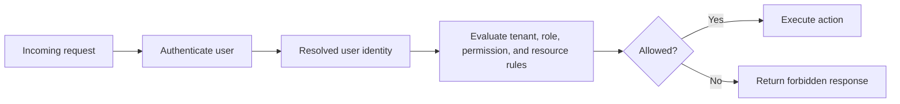
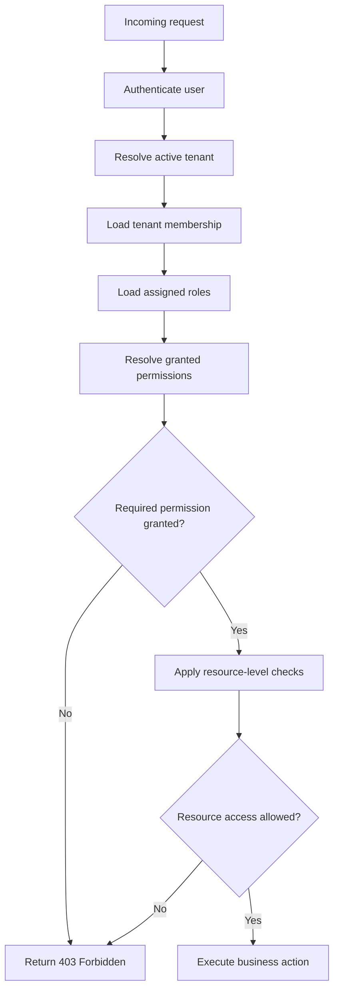
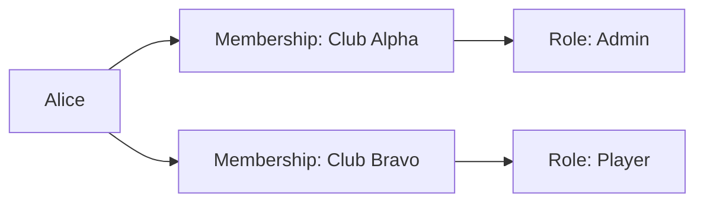
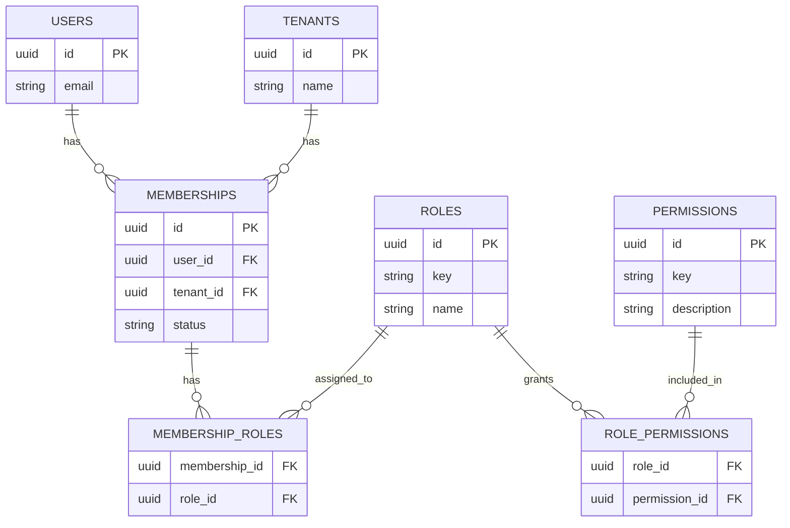
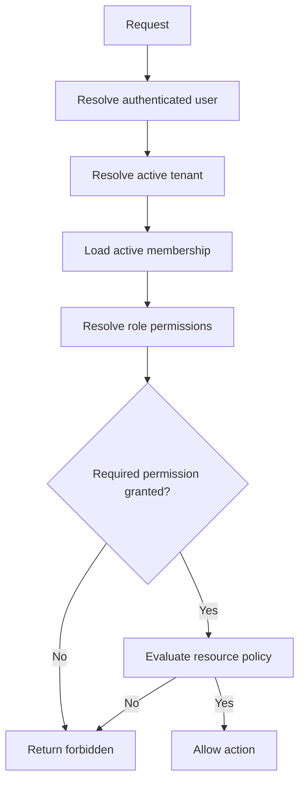
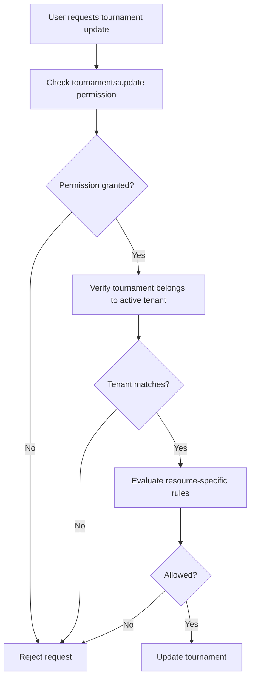
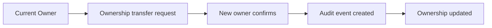
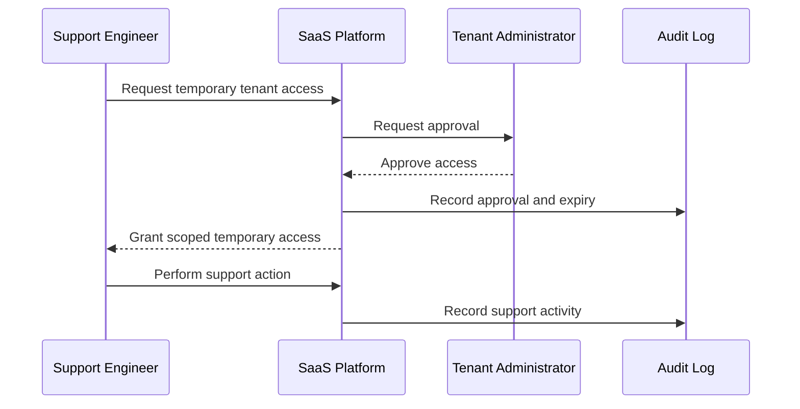

# Role-Based Access Control (RBAC)

> A practical guide to designing roles, permissions, and tenant-scoped authorization for production SaaS applications.

---

## Overview

Authentication answers:

> Who is making this request?

Authorization answers:

> Is this authenticated identity allowed to perform this action?

Role-Based Access Control (RBAC) is one of the most widely used authorization models for answering that second question.

Instead of assigning permissions directly to every user, RBAC groups permissions into reusable roles. Users receive one or more roles, and roles determine which actions they may perform.

For example:

```text
Organization Admin
├── Invite users
├── Manage billing
├── Configure organization settings
├── Create tournaments
└── Delete tournaments

Tournament Manager
├── Create tournaments
├── Update tournament settings
├── Manage players
└── Record match scores

Player
├── View tournament information
├── View schedules
└── Update own profile
```

RBAC simplifies permission management, improves consistency, and gives administrators a clear mental model of access control.

However, RBAC alone is not enough for every production system.

A user may have permission to update tournaments but should still be prevented from editing:

- A tournament belonging to another tenant.
- A tournament outside their assigned club.
- A tournament they are not responsible for.
- A resource that has been archived or locked.

For this reason, RBAC should be treated as one layer of a broader authorization design.

This article explains how RBAC works, how to model it in a database, how it fits into multi-tenant SaaS, and when more fine-grained authorization is required.

---

## Learning Objectives

After reading this article, you should be able to:

- Explain the difference between authentication, authorization, roles, and permissions.
- Design a basic RBAC data model.
- Apply RBAC in a multi-tenant SaaS application.
- Understand tenant-scoped roles and permissions.
- Identify the limitations of RBAC.
- Combine RBAC with resource ownership and policy checks.
- Avoid common authorization mistakes.
- Choose an access-control approach that can evolve with the product.

---

## Table of Contents

1. Authentication vs Authorization
2. The Problem RBAC Solves
3. Core Concepts
4. How RBAC Works
5. Roles and Permissions
6. Tenant-Scoped RBAC
7. RBAC Data Model
8. Authorization Flow
9. RBAC and Resource Ownership
10. RBAC Limitations
11. Roles vs Permissions vs Policies
12. Admin and Support Access
13. Auditability
14. Caching Authorization Data
15. Common Mistakes
16. Recommended Defaults
17. Key Takeaways
18. Related Articles

---

# Authentication vs Authorization

Authentication and authorization are distinct responsibilities.

| Concept | Question | Example |
|---|---|---|
| Authentication | Who are you? | Is this request really from Alice? |
| Authorization | What may you do? | Can Alice edit this tournament? |

A successful login does not grant unrestricted access.

For example:

```text
Alice is authenticated.
```

This does not automatically mean:

```text
Alice can manage billing.
Alice can delete users.
Alice can access Club Beta.
Alice can edit every tournament.
```

Authorization evaluates the authenticated user's permissions in context.



---

# The Problem RBAC Solves

As an application grows, different users need different access levels.

A simple platform may begin with two user types:

```text
Admin
Player
```

Over time, requirements become more detailed.

```text
Organization Owner
Organization Admin
Tournament Manager
Coach
Scorekeeper
Player
Viewer
Billing Manager
Support Agent
```

Without a structured authorization model, applications often accumulate fragile checks throughout the codebase.

```ts
if (user.isAdmin) {
  // allow action
}
```

Then another feature adds:

```ts
if (user.isAdmin || user.isCoach) {
  // allow action
}
```

Then another feature needs a special exception:

```ts
if (user.isAdmin || user.isCoach || user.id === tournament.createdByUserId) {
  // allow action
}
```

Over time, authorization logic becomes inconsistent, difficult to test, and easy to bypass.

RBAC creates a reusable model.

```text
Users
  ↓
Roles
  ↓
Permissions
  ↓
Allowed actions
```

Instead of scattering permission logic everywhere, the application asks:

> Does this user's active role grant the required permission for this action?

---

# Core Concepts

## Permission

A permission is the smallest meaningful unit of access.

Permissions should describe capabilities, not job titles.

Examples:

```text
tournaments:read
tournaments:create
tournaments:update
tournaments:delete

players:read
players:manage

memberships:invite
memberships:remove

billing:read
billing:manage
```

Permissions should be stable, explicit, and understandable.

Avoid vague permissions such as:

```text
admin_access
manage_everything
special_access
```

These become difficult to reason about as the application grows.

---

## Role

A role is a named collection of permissions.

Example:

```text
Tournament Manager
├── tournaments:read
├── tournaments:create
├── tournaments:update
├── players:read
└── players:manage
```

Roles communicate business intent.

A human administrator should be able to understand what a role means without reading source code.

---

## Assignment

A role assignment connects a user to a role within a specific context.

In a multi-tenant SaaS application, this context is usually a tenant or organization.

```text
Alice
  ↓
Tournament Manager
  ↓
Club Alpha
```

The same user can have a different role elsewhere.

```text
Alice
├── Club Alpha → Tournament Manager
├── Club Bravo → Player
└── Club Gamma → Viewer
```

---

## Scope

Scope defines where a permission applies.

For example:

```text
Permission: tournaments:update
Scope: Club Alpha
```

The same permission might be valid in one tenant but invalid in another.

Scopes can also represent:

- Team
- Department
- Project
- Region
- Resource group

In most early-stage multi-tenant SaaS products, tenant scope is the most important starting point.

---

# How RBAC Works

A typical RBAC check follows this sequence:

1. Authenticate the user.
2. Resolve the active tenant.
3. Find the user's membership in that tenant.
4. Load the membership's assigned role or roles.
5. Resolve the permissions granted by those roles.
6. Compare those permissions with the required action.
7. Apply resource-level checks where necessary.



Consider this example request:

```http
POST /api/tournaments
```

The endpoint may require:

```text
tournaments:create
```

The authorization service evaluates:

```text
User: Alice
Tenant: Club Alpha
Role: Tournament Manager
Permission required: tournaments:create
Decision: allowed
```

The exact same user may receive a different result in another tenant.

```text
User: Alice
Tenant: Club Bravo
Role: Player
Permission required: tournaments:create
Decision: denied
```

This is why multi-tenant roles must be scoped to the active tenant.

---

# Roles and Permissions

A good RBAC system keeps roles understandable while avoiding unnecessary duplication.

A practical starting role set for many SaaS platforms is:

| Role | Typical Responsibility |
|---|---|
| Owner | Full organization control, including ownership and billing |
| Admin | Organization management without ownership transfer |
| Manager | Operational management for a business area |
| Member | Standard collaboration access |
| Viewer | Read-only access |
| Support | Limited support access, usually audited and time-bound |

For a tournament-management product, that might become:

| Role | Typical Permissions |
|---|---|
| Club Owner | All tenant-scoped permissions, billing, ownership transfer |
| Club Admin | Membership, settings, tournaments, courts, players |
| Tournament Manager | Tournament, match, and participant operations |
| Scorekeeper | Update permitted scores and match status |
| Coach | View assigned players and training records |
| Player | View own events and update own profile |
| Viewer | Read-only access to permitted content |

Do not create a new role for every small variation too early.

For example, these may be unnecessarily specific at first:

```text
Tournament Manager - Junior Events
Tournament Manager - Adult Events
Tournament Manager - Weekend Events
```

A better approach is often to keep roles broad and add resource-level policies only when real requirements demand them.

---

# Tenant-Scoped RBAC

In a multi-tenant SaaS application, roles must be assigned within a tenant context.

A global role assignment is usually too broad.

For example, this is unsafe:

```text
Alice → Admin
```

It does not answer:

- Admin of which organization?
- Can Alice manage every tenant?
- Can Alice access another club's billing data?
- Can Alice delete users from an unrelated tenant?

A safer model is:

```text
Alice → Club Alpha → Admin
Alice → Club Bravo → Player
```



The active tenant determines which membership and role assignment applies.

This means the same authenticated user can have different permissions depending on where they are operating.

---

## Tenant-Scoped Permission Check

Consider this request:

```http
POST /api/tournaments
Host: club-alpha.example.com
```

The application should evaluate:

```text
User: Alice
Tenant: Club Alpha
Required permission: tournaments:create
```

Then compare the permission against Alice's membership in Club Alpha.

The application should not evaluate only:

```text
User: Alice
Role: Admin
```

because that creates a risk that Alice's role from Club Alpha is accidentally reused in Club Bravo or another tenant.

The tenant is part of the authorization boundary.

---

# RBAC Data Model

A normalized RBAC model usually separates users, tenants, memberships, roles, permissions, and assignments.



This structure supports:

- One user belonging to many tenants.
- One tenant containing many users.
- A membership holding one or more roles.
- A role granting many permissions.
- A permission being included in several roles.

---

## Core Tables

A simplified schema might look like this.

### `tenants`

```sql
CREATE TABLE tenants (
  id UUID PRIMARY KEY,
  name TEXT NOT NULL,
  slug TEXT NOT NULL UNIQUE,
  created_at TIMESTAMPTZ NOT NULL DEFAULT NOW()
);
```

### `users`

```sql
CREATE TABLE users (
  id UUID PRIMARY KEY,
  email TEXT NOT NULL UNIQUE,
  display_name TEXT NOT NULL,
  created_at TIMESTAMPTZ NOT NULL DEFAULT NOW()
);
```

### `memberships`

```sql
CREATE TABLE memberships (
  id UUID PRIMARY KEY,
  tenant_id UUID NOT NULL REFERENCES tenants(id),
  user_id UUID NOT NULL REFERENCES users(id),
  status TEXT NOT NULL DEFAULT 'active',
  created_at TIMESTAMPTZ NOT NULL DEFAULT NOW(),
  UNIQUE (tenant_id, user_id)
);
```

The unique constraint prevents the same user from receiving duplicate memberships in the same tenant.

### `roles`

```sql
CREATE TABLE roles (
  id UUID PRIMARY KEY,
  key TEXT NOT NULL UNIQUE,
  name TEXT NOT NULL,
  description TEXT
);
```

Example role keys:

```text
owner
admin
tournament_manager
scorekeeper
player
viewer
```

### `permissions`

```sql
CREATE TABLE permissions (
  id UUID PRIMARY KEY,
  key TEXT NOT NULL UNIQUE,
  description TEXT NOT NULL
);
```

Example permission keys:

```text
tournaments:create
tournaments:update
tournaments:delete
matches:update_score
memberships:invite
billing:manage
```

### `membership_roles`

```sql
CREATE TABLE membership_roles (
  membership_id UUID NOT NULL REFERENCES memberships(id),
  role_id UUID NOT NULL REFERENCES roles(id),
  PRIMARY KEY (membership_id, role_id)
);
```

### `role_permissions`

```sql
CREATE TABLE role_permissions (
  role_id UUID NOT NULL REFERENCES roles(id),
  permission_id UUID NOT NULL REFERENCES permissions(id),
  PRIMARY KEY (role_id, permission_id)
);
```

---

## One Role or Multiple Roles?

A membership may have one role or multiple roles.

### One Role Per Membership

```text
Alice → Club Alpha → Tournament Manager
```

Advantages:

- Easier to explain.
- Easier to administer.
- Fewer combinations to test.
- Good starting point for many products.

Disadvantages:

- Can lead to too many specialized roles later.
- Less flexible when responsibilities overlap.

### Multiple Roles Per Membership

```text
Alice → Club Alpha
├── Tournament Manager
└── Billing Manager
```

Advantages:

- More flexible.
- Reduces the number of composite roles.
- Supports complex organizations.

Disadvantages:

- Harder to understand.
- Requires conflict and permission-union rules.
- Can make access review more difficult.

For an early-stage SaaS product, start with one role per membership unless you already have clear cases requiring multiple independent responsibilities.

You can evolve to multiple roles later if the data model supports it.

---

# Authorization Service Design

Authorization checks should not be scattered throughout controllers, route handlers, and UI components.

A dedicated authorization service creates a consistent enforcement point.

Conceptually:

```text
can(user, tenant, permission, resource?)
```

Example:

```ts
const allowed = await authorizationService.can({
  userId: currentUser.id,
  tenantId: activeTenant.id,
  permission: "tournaments:update",
  resource: tournament,
});
```

The service should perform the required checks in a predictable order.



A clean authorization service makes it easier to:

- Test rules centrally.
- Add audit logging.
- Add caching.
- Change role definitions.
- Add policy checks later.
- Prevent inconsistent enforcement.

---

## Middleware vs Business-Layer Authorization

Authorization is often enforced in more than one place.

### Route or Middleware Layer

Middleware can reject requests early.

Example:

```text
POST /api/tournaments
Required permission: tournaments:create
```

This is useful for simple endpoint-level checks.

### Business-Layer Authorization

The business layer should still validate authorization before performing sensitive operations.

Why?

Because business logic may be called from places other than HTTP routes:

- Background jobs
- Event consumers
- Internal scripts
- Command-line tools
- Admin workflows

A useful rule is:

> Middleware protects the entry point. Business-layer checks protect the action itself.

---

# RBAC and Resource Ownership

RBAC answers:

> Does this role generally allow this kind of action?

Resource ownership answers:

> Is this user allowed to perform that action on this specific resource?

For example, a Tournament Manager may have:

```text
tournaments:update
```

But the system may still need to check:

- Does the tournament belong to the active tenant?
- Is the tournament archived?
- Is the user assigned to manage this event?
- Is the tournament locked because matches have started?
- Is the user editing a protected system tournament?



A role should never bypass tenant ownership checks.

For example, this is unsafe:

```ts
if (user.role === "admin") {
  return tournamentRepository.update(tournamentId, input);
}
```

This is safer:

```ts
const tournament = await tournamentRepository.findById({
  tenantId,
  tournamentId,
});

if (!tournament) {
  throw new NotFoundError();
}

await authorizationService.requirePermission({
  userId,
  tenantId,
  permission: "tournaments:update",
});

await tournamentPolicy.requireUpdateAccess({
  userId,
  tenantId,
  tournament,
});

return tournamentRepository.update({
  tenantId,
  tournamentId,
  input,
});
```

The repository itself should remain tenant-scoped so that a resource from another tenant is never loaded accidentally.

---

# RBAC Limitations

RBAC is powerful, but it is not a complete answer for every authorization requirement.

RBAC becomes difficult when access depends heavily on dynamic conditions.

Examples:

- A coach may view only assigned players.
- A scorekeeper may update scores only for matches assigned to them.
- A manager may approve requests only below a monetary threshold.
- A user may access a document only until a deadline.
- A player may edit only their own profile.

These rules depend on relationships and attributes, not only roles.

```text
Role: Coach
Permission: players:read

Additional rule:
Coach can read only players assigned to that coach.
```

RBAC should remain the baseline, while dynamic rules are handled by resource policies or attribute-based checks.

---

# Roles vs Permissions vs Policies

These three concepts are often confused.

| Concept | Purpose | Example |
|---|---|---|
| Role | Named bundle of permissions | `tournament_manager` |
| Permission | Atomic capability | `tournaments:update` |
| Policy | Context-aware rule for a specific resource | Can update only tournaments in the active tenant |

A practical authorization model often looks like this:

```text
Role
  ↓
Permission
  ↓
Resource Policy
  ↓
Allowed or Denied
```

Example:

```text
Alice has role: Tournament Manager
Tournament Manager grants: tournaments:update
Policy checks: tournament belongs to Club Alpha and is not locked
Decision: allowed
```

---

# Attribute-Based Access Control

Attribute-Based Access Control, often called ABAC, evaluates attributes instead of relying only on roles.

Example attributes include:

- User department
- User region
- Subscription plan
- Resource classification
- Time of day
- User employment status
- Tenant tier

A policy might be:

```text
Allow report export when:
- user.department = finance
- tenant.plan = enterprise
- report.classification != restricted
```

ABAC is flexible but more difficult to reason about and test.

For most SaaS products, a practical evolution path is:

```text
Start with tenant-scoped RBAC
    ↓
Add resource policies for real exceptions
    ↓
Adopt broader attribute-based rules only when needed
```

Avoid introducing a complex policy engine before the product has demonstrated a real need for it.

---

# Admin and Support Access

Administrative and support access requires special care.

A tenant administrator should have broad authority within their own tenant, but that authority should not automatically extend across the entire platform.

Likewise, internal support staff may need limited access to investigate incidents, but unrestricted support access creates a major security and privacy risk.

---

## Tenant Owner vs Tenant Administrator

A useful distinction is:

| Role | Typical Responsibility |
|---|---|
| Owner | Highest authority within a tenant; may manage billing, ownership transfer, and tenant deletion |
| Admin | Broad operational management, but not necessarily ownership or billing transfer |
| Manager | Manages a functional area such as tournaments, players, or memberships |
| Member | Standard tenant user |
| Viewer | Read-only access |

For example:

```text
Club Alpha

Owner
├── Manage billing
├── Transfer ownership
├── Delete club
├── Manage all members
└── Manage all tournaments

Admin
├── Manage members
├── Configure club settings
├── Manage tournaments
└── Manage courts
```

The Owner role should be assigned sparingly.

Many SaaS applications allow only one owner or require an explicit ownership-transfer workflow.



Ownership transfer should normally require:

- Reauthentication
- Explicit confirmation from both parties where appropriate
- Audit logging
- Notification to the current and new owner
- Restrictions when billing or legal obligations are unresolved

---

## Platform Administrators

Platform administrators are employees or operators of the SaaS provider, not members of a customer tenant.

They may need capabilities such as:

- View platform health
- Investigate abuse
- Assist with account recovery
- Manage subscription records
- Respond to security incidents

However, platform administration should not become an unrestricted bypass for tenant data.

A safer model separates platform administration from tenant membership.

```text
Platform Admin
├── Manage platform-level operations
├── View tenant metadata
├── Trigger approved support workflows
└── Cannot automatically access tenant business data
```

When tenant access is necessary, use controlled support access.

---

## Controlled Support Access

Support access should be:

- Explicit
- Time-bound
- Scoped
- Audited
- Revocable

For example:

```text
Support engineer requests access to Club Alpha
    ↓
Customer approval or policy-based authorization
    ↓
Temporary support session created
    ↓
Access expires automatically after 30 minutes
    ↓
All actions recorded in audit logs
```



A support session might include restrictions such as:

```text
Scope:
- Read-only access
- Only Club Alpha
- Only billing configuration
- Expires in 30 minutes
```

Avoid permanent hidden impersonation capabilities.

They are difficult to audit, easy to misuse, and dangerous if an internal account is compromised.

---

# Auditability

Authorization decisions affect sensitive resources.

A production system should record important access-control events.

Examples include:

- Role assigned
- Role removed
- Permission changed
- Invitation created
- Invitation accepted
- Membership suspended
- Membership removed
- Ownership transferred
- Support access granted
- Support access revoked
- Permission-denied event for sensitive operations

An audit log should answer:

- Who performed the action?
- Which tenant was affected?
- What changed?
- When did it happen?
- From which request, IP address, or device?
- Was the action performed by a tenant user, support staff, or automation?

Example audit event:

```json
{
  "eventType": "membership.role_assigned",
  "tenantId": "club_alpha",
  "actorUserId": "user_42",
  "targetUserId": "user_99",
  "previousRole": "player",
  "newRole": "tournament_manager",
  "requestId": "req_abc123",
  "createdAt": "2026-07-03T14:20:00Z"
}
```

Audit logs should be append-only whenever possible.

Do not allow ordinary administrators to edit or delete authorization history.

---

# Caching Authorization Data

Authorization checks can become expensive if every request requires several database queries.

For example, one request may need to load:

- The authenticated user
- The active tenant
- The membership
- Assigned roles
- Role permissions
- Feature flags
- Resource ownership metadata

Caching can improve performance, but authorization caches must be designed carefully.

---

## What Can Be Cached?

Common cache candidates include:

- Tenant membership status
- Role assignments
- Permission sets
- Feature entitlements
- Tenant configuration

Example cache key:

```text
tenant:club-alpha:user:user-42:permissions
```

Avoid generic keys such as:

```text
user-42:permissions
```

because the same user may have different permissions in different tenants.

---

## Cache Invalidation

Authorization data changes must invalidate the corresponding cache.

For example:

```text
Role changed
    ↓
Invalidate:
tenant:club-alpha:user:user-42:permissions
```

Events that should trigger invalidation include:

- Role assignment
- Role removal
- Membership suspension
- Membership deletion
- Permission changes
- Tenant suspension
- Plan downgrade affecting feature access

A short Time-To-Live can reduce stale access windows, but event-driven invalidation is more responsive for sensitive changes.

---

## Do Not Cache Everything Blindly

Authorization caching can create risk when:

- A user is removed from a tenant.
- A role is downgraded.
- A support session expires.
- A tenant is suspended.
- An account is locked.

For sensitive operations, consider server-side checks against current data even if broader permission information is cached.

A useful rule is:

> Cache for performance, but preserve a reliable way to invalidate or re-check critical access decisions.

---

# Common Mistakes

## Assigning Roles Globally Instead of Per Tenant

This is unsafe:

```text
Alice → Admin
```

This is safer:

```text
Alice → Club Alpha → Admin
```

The tenant must be part of the role assignment and authorization check.

---

## Treating Roles as the Only Authorization Rule

A role may grant a general capability, but resource-level checks are still required.

For example:

```text
Tournament Manager can update tournaments
```

does not automatically mean:

```text
Tournament Manager can update a tournament from another tenant
```

Always validate tenant ownership and resource-specific conditions.

---

## Checking Permissions Only in the User Interface

Hiding a button is not authorization.

A malicious user can call an API directly.

Authorization must be enforced by the backend before performing the protected action.

---

## Using Client-Supplied Roles

Never trust role information sent by the frontend.

This is unsafe:

```json
{
  "role": "admin"
}
```

The server should derive role assignments from trusted authentication and membership data.

---

## Creating Too Many Roles Too Early

A large number of narrowly defined roles makes the system difficult to understand and maintain.

Start with a small, meaningful role set.

Add specialized roles only when real operational requirements emerge.

---

## Giving Every Administrator Full Billing Access

Operational administration and billing administration are not always the same responsibility.

Separate permissions such as:

```text
billing:read
billing:manage
memberships:manage
settings:update
```

This reduces unnecessary access to financial information.

---

## Allowing Hidden Support Bypasses

Internal support access should be visible, scoped, time-limited, and audited.

Avoid invisible permanent impersonation mechanisms.

---

## Returning the Wrong Error

When a user attempts to access a resource belonging to another tenant, returning `404 Not Found` can be safer than revealing that the resource exists.

For example:

```text
Requested tournament does not exist in active tenant context.
```

This reduces information disclosure.

The exact behavior depends on your API conventions, but consistency is important.

---

# Recommended Defaults

These are practical starting defaults for many multi-tenant SaaS applications.

| Concern | Recommended Starting Point |
|---|---|
| Role scope | Per tenant membership |
| Role assignment | One role per membership initially |
| Permission format | `resource:action` |
| Tenant ownership | Enforced in every repository query |
| Authorization enforcement | Middleware plus business-layer checks |
| Resource rules | Add policy checks for real exceptions |
| Owner role | Keep limited and explicitly managed |
| Support access | Time-bound, scoped, audited |
| Permission caching | Tenant-scoped cache keys with reliable invalidation |
| Audit logging | Record all role, membership, and support-access changes |
| Sensitive access changes | Require reauthentication or stronger confirmation where appropriate |

A practical progression is:

```text
Tenant-scoped RBAC
    ↓
Resource-level policy checks
    ↓
Fine-grained attribute-based rules only when real product requirements demand them
```

This approach keeps the initial implementation understandable while leaving room for future complexity.

---

# Key Takeaways

- RBAC is a widely used authorization model that groups permissions into reusable roles.
- Authentication establishes identity; RBAC determines which capabilities that identity has.
- In multi-tenant SaaS, role assignments must be scoped to the active tenant.
- A user's role in one tenant must never grant access in another tenant.
- Permissions should be explicit, stable, and capability-based.
- RBAC should be combined with tenant ownership and resource-level policy checks.
- Middleware protects HTTP entry points, while business-layer authorization protects sensitive actions from every execution path.
- Platform support access should be time-bound, scoped, and fully audited.
- Authorization data can be cached, but cache invalidation is critical after role or membership changes.
- Start simple with tenant-scoped RBAC, then introduce policies or attribute-based rules only when real requirements justify them.

---

# Related Articles

- [Session vs JWT Authentication](./session-vs-jwt-authentication.md)
- [Refresh Token Rotation](./refresh-token-rotation.md)
- [Multi-Tenant SaaS Architecture](../saas/multi-tenant-architecture.md)
- Multi-Tenant Authentication
- Tenant Identification
- Tenant Isolation
- API Security
- Row Level Security
- Audit Logging
- Feature Flags
