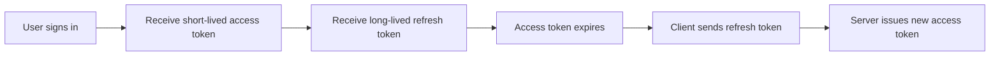
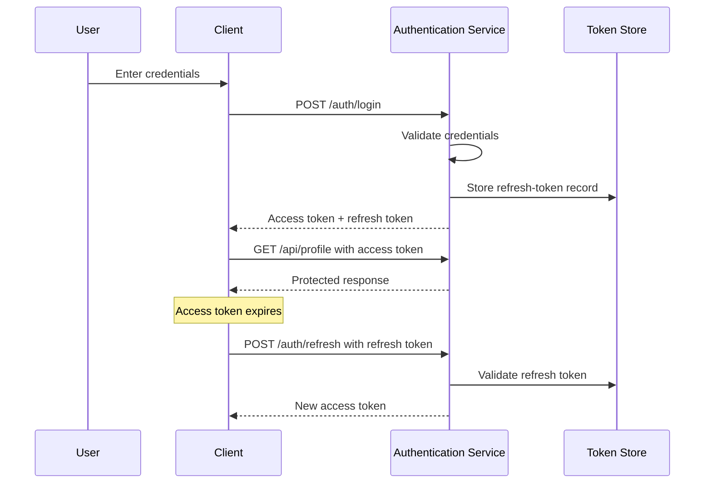
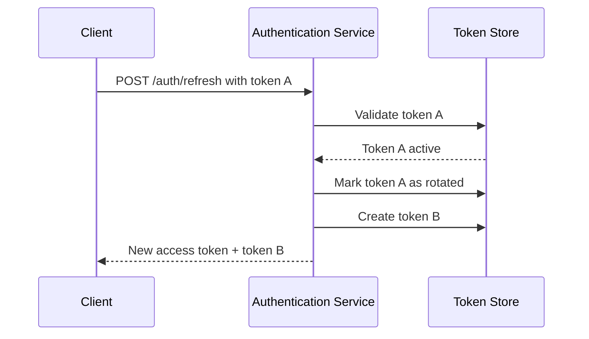
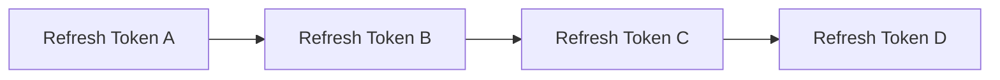
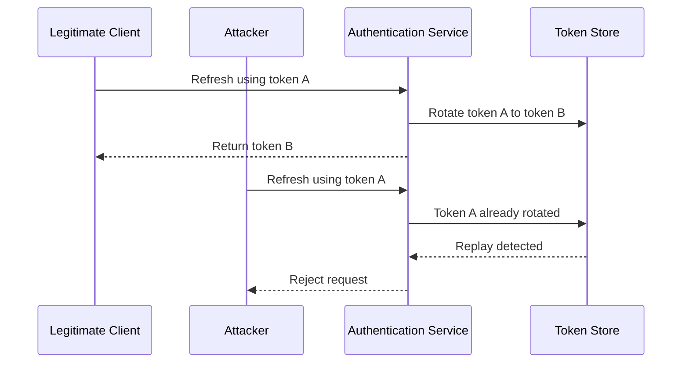
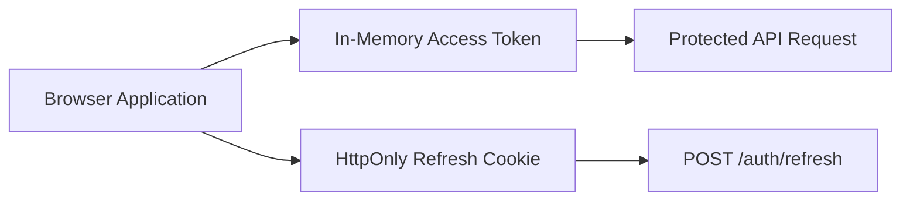
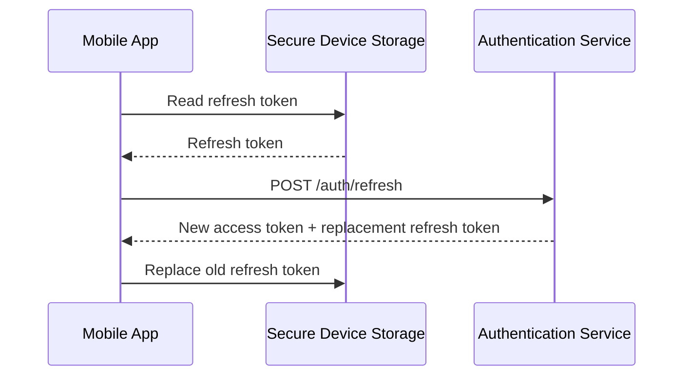
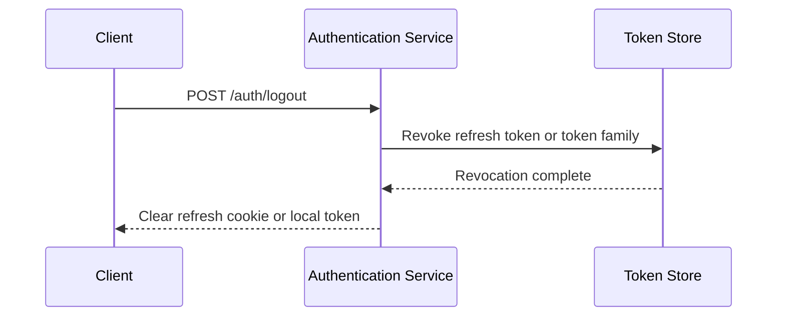
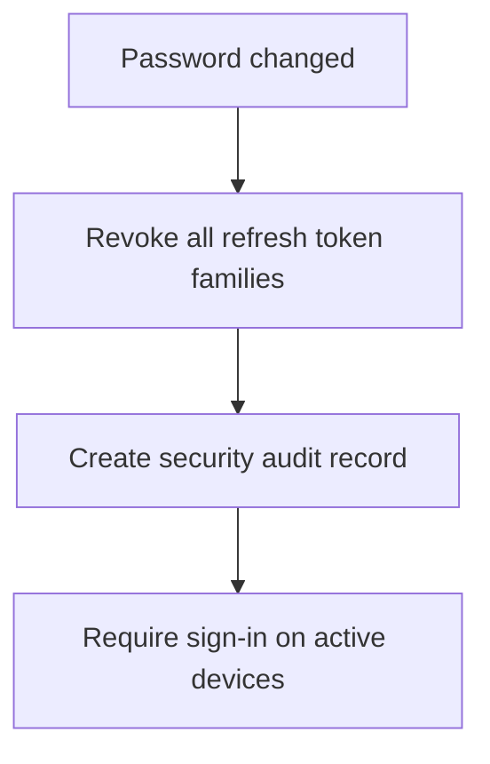
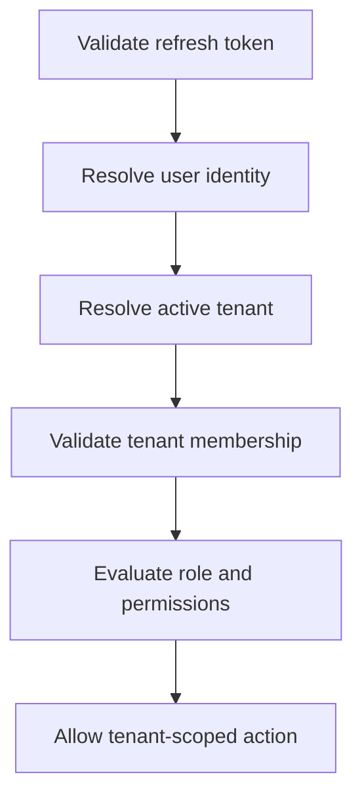

# Refresh Token Rotation

> A practical guide to designing refresh-token rotation for secure, long-lived authentication sessions in browser, mobile, and API-based applications.

---

## Overview

Short-lived access tokens reduce the impact of token theft, but they create a usability problem.

If an access token expires every 10 or 15 minutes, users would need to sign in repeatedly unless the application has a secure way to renew their authentication state.

Refresh tokens solve this problem.

A refresh token is a long-lived credential that allows a trusted client to request a new short-lived access token without asking the user to log in again.

Refresh token rotation improves this design by replacing the refresh token every time it is used.

This creates an important security property:

> A refresh token should normally be usable only once.

If an old refresh token is used again after it has already been rotated, the system can treat that event as a possible token theft or replay attack.

This article explains how refresh token rotation works, why it matters, how to model it in a database, and how to implement it safely in production systems.

---

## Learning Objectives

After reading this article, you should be able to:

- Explain the purpose of refresh tokens.
- Describe the refresh token rotation flow.
- Understand token families and replay detection.
- Design a refresh-token data model.
- Handle logout, password changes, and device revocation.
- Choose suitable storage strategies for browser and mobile clients.
- Identify common refresh-token implementation mistakes.
- Apply refresh-token rotation in a multi-tenant SaaS application.

---

## Table of Contents

1. The Problem
2. Access Tokens and Refresh Tokens
3. What Is Refresh Token Rotation?
4. Standard Rotation Flow
5. Token Families
6. Replay Detection
7. Refresh Token Data Model
8. Browser Storage
9. Mobile Storage
10. Logout and Revocation
11. Password Changes and Security Events
12. Refresh Endpoints
13. Multi-Tenant Considerations
14. Common Mistakes
15. Recommended Defaults
16. Key Takeaways
17. Related Articles

---

# The Problem

Modern applications need to balance two competing goals:

1. Keep users signed in without asking for credentials too often.
2. Limit the damage if an authentication token is stolen.

Long-lived access tokens solve the first problem but create unnecessary security risk.

For example:

```text
Access token lifetime: 30 days
```

If that token is stolen on day one, an attacker may be able to use it for the next 29 days.

Short-lived access tokens reduce the risk window.

```text
Access token lifetime: 15 minutes
```

However, users would then need to log in again every 15 minutes unless the application can securely issue replacement access tokens.

Refresh tokens provide that capability.



The access token is used often and should expire quickly.

The refresh token is used less often and should be protected more carefully.

---

# Access Tokens and Refresh Tokens

Access tokens and refresh tokens serve different purposes.

| Token Type | Primary Purpose | Typical Lifetime | Usage Frequency |
|---|---|---:|---|
| Access token | Access protected APIs | 5–30 minutes | Frequent |
| Refresh token | Obtain a new access token | Days or weeks | Infrequent |

A typical authentication flow looks like this:



The refresh token should not be sent with every API request.

It should be restricted to the refresh flow only.

---

# What Is Refresh Token Rotation?

Refresh token rotation means issuing a new refresh token whenever an existing refresh token is used successfully.

Instead of this:

```text
Refresh token A
    ↓
Use repeatedly for 30 days
```

the system uses this model:

```text
Refresh token A
    ↓
Used once
    ↓
Refresh token B
    ↓
Used once
    ↓
Refresh token C
```

Each refresh token becomes invalid immediately after being exchanged.



This reduces the usefulness of a stolen refresh token.

If an attacker steals token A but the legitimate client has already used it and received token B, token A should no longer work.

---

# Standard Rotation Flow

A secure refresh flow typically follows these steps.

## 1. Client Sends a Refresh Token

The client calls a dedicated endpoint.

```http
POST /auth/refresh
```

The refresh token is usually sent through:

- A Secure, HttpOnly cookie for browser applications.
- Secure platform storage for mobile applications.
- A request body only when the client type and transport are appropriate.

---

## 2. Server Validates the Token

The server should validate:

- Token format
- Token existence
- Token expiration
- Token revocation status
- Token family status
- Client or device metadata where applicable

The server should not trust a token merely because it looks structurally valid.

---

## 3. Server Invalidates the Current Token

If the token is valid, it is marked as rotated or revoked.

```text
Token A status: rotated
```

The token must no longer be accepted in future refresh attempts.

---

## 4. Server Creates a Replacement Token

The server creates a new refresh token.

```text
Token B status: active
```

The new token belongs to the same token family as token A.

---

## 5. Server Issues a New Access Token

The response includes a new short-lived access token.

For browser clients, the replacement refresh token is typically written into a new secure cookie.

```http
Set-Cookie: refresh_token=token_b; HttpOnly; Secure; SameSite=Lax; Path=/auth/refresh
```

---

# Token Families

A token family represents a chain of refresh tokens created from a single login session.

For example:

```text
Login session
    │
    ├── Token A
    │     └── rotated into Token B
    │            └── rotated into Token C
    │                   └── rotated into Token D
```

All of these tokens belong to the same token family.



Token families make it possible to revoke an entire device session.

For example, if refresh token B is suspected to be stolen, the application can revoke every token in that family.

```text
Token family: revoked
```

The user must then authenticate again on that device.

---

## Why Token Families Matter

Without token families, it is difficult to understand the relationship between rotated tokens.

With token families, the application can answer questions such as:

- Which device session created this token?
- Which refresh token replaced this one?
- Has this device session been revoked?
- Has an old token been reused?
- Should every token from this login session be invalidated?

This improves both security and operational visibility.

---

# Replay Detection

Replay detection is one of the main reasons to use refresh token rotation.

A replay happens when a refresh token that has already been used is submitted again.

For example:

```text
1. User signs in and receives token A.
2. Attacker steals token A.
3. Legitimate user refreshes access and receives token B.
4. Attacker tries to use token A.
```

At step four, token A should already be invalid.



A strong response to replay detection is to revoke the entire token family.

Why?

Because the system cannot safely determine whether the legitimate client or the attacker currently owns the newest valid token.

```text
Replay detected
    ↓
Revoke token family
    ↓
Require login again
```

This may inconvenience the legitimate user, but it prevents an attacker from continuing to refresh stolen credentials.

---

# Refresh Token Data Model

Refresh tokens should normally be represented in server-side storage.

Do not store raw refresh tokens in the database.

Instead, store a cryptographic hash of the token, similar to password storage.

A simplified table might look like this:

```text
refresh_tokens
```

| Column | Purpose |
|---|---|
| `id` | Internal identifier |
| `token_hash` | Hash of the refresh token |
| `user_id` | Owner of the token |
| `tenant_id` | Active tenant or tenant context if applicable |
| `family_id` | Identifies the token family |
| `parent_token_id` | Previous token in the rotation chain |
| `expires_at` | Expiration time |
| `created_at` | Creation time |
| `rotated_at` | When the token was rotated |
| `revoked_at` | When the token was revoked |
| `revocation_reason` | Why it was invalidated |
| `ip_address` | Optional login metadata |
| `user_agent` | Optional device metadata |

Example conceptual record:

```json
{
  "id": "rt_01",
  "userId": "user_42",
  "familyId": "family_abc",
  "parentTokenId": null,
  "tokenHash": "hashed-secret-value",
  "expiresAt": "2026-08-02T10:00:00Z",
  "rotatedAt": null,
  "revokedAt": null
}
```

After rotation:

```json
{
  "id": "rt_01",
  "rotatedAt": "2026-07-03T10:15:00Z"
}
```

A new record is created:

```json
{
  "id": "rt_02",
  "userId": "user_42",
  "familyId": "family_abc",
  "parentTokenId": "rt_01",
  "tokenHash": "new-hashed-secret-value",
  "expiresAt": "2026-08-02T10:15:00Z"
}
```

The raw token should be shown to the client only once, at issuance time.

---

# Browser Storage

Browser applications need special care because the browser manages cookies automatically and JavaScript may execute inside the application context.

A common production pattern is:

```text
Access token:
- Stored in application memory
- Short-lived
- Sent through Authorization header

Refresh token:
- Stored in Secure, HttpOnly cookie
- Long-lived
- Sent only to the refresh endpoint
```



The access token remains available to the running application but disappears after a full page reload.

The refresh token survives the reload because the browser manages it as a cookie. The application can then call the refresh endpoint to obtain a replacement access token.

---

## Recommended Refresh Cookie Attributes

A browser refresh token should normally use restrictive cookie settings.

```http
Set-Cookie: refresh_token=<token>;
HttpOnly;
Secure;
SameSite=Lax;
Path=/auth/refresh;
Max-Age=2592000
```

| Attribute | Why It Matters |
|---|---|
| `HttpOnly` | Prevents JavaScript from directly reading the cookie value. |
| `Secure` | Restricts transmission to HTTPS connections. |
| `SameSite` | Reduces cross-site request risks. |
| `Path` | Limits which endpoint receives the refresh token. |
| `Max-Age` | Defines the maximum cookie lifetime. |

`SameSite=Lax` is often a practical default for many browser SaaS applications.

`SameSite=Strict` provides stronger cross-site restrictions but can cause usability issues in some login, invitation, or external-link flows.

`SameSite=None` should be used only when cross-site cookies are genuinely required. It requires `Secure` and increases the importance of robust CSRF protections.

---

## CSRF Protection for Refresh Endpoints

An HttpOnly refresh cookie cannot be read by JavaScript, but the browser may still send it automatically.

That means the refresh endpoint should be protected against Cross-Site Request Forgery.

Common protections include:

- `SameSite` cookie configuration
- Origin validation
- Referer validation
- Anti-CSRF tokens
- Strict CORS configuration
- Restricting refresh cookies to a narrow path

A refresh endpoint should not accept arbitrary cross-origin requests.

```text
Allowed origin:
https://app.example.com

Rejected origin:
https://malicious.example
```

---

# Mobile Storage

Mobile applications do not use browser cookies in the same way as web applications.

Refresh tokens should be stored in platform-provided secure storage.

Examples include:

| Platform | Preferred Storage |
|---|---|
| iOS | Keychain |
| Android | Keystore-backed encrypted storage |
| React Native | Secure storage library backed by native secure storage |
| Flutter | Secure storage plugin backed by Keychain or Keystore |

Avoid storing refresh tokens in:

- Plain application preferences
- Unencrypted SQLite databases
- Logs
- Analytics events
- Crash-report metadata
- Source code
- Shared files

A mobile refresh flow commonly looks like this:



The application should replace the old refresh token only after the server confirms the rotation succeeded.

---

# Logout and Revocation

Logout should invalidate server-side authentication state.

Deleting a token only from the client is not enough.

For example, clearing a browser cookie may remove local access, but a stolen copy of the refresh token could remain usable until expiration.

A complete logout flow should:

1. Identify the current refresh token or token family.
2. Revoke the active refresh token.
3. Optionally revoke the entire token family.
4. Clear the client-side cookie or secure-storage value.
5. Record an audit event.



---

## Logout from One Device

A user may want to end a session only on the current device.

In that case, revoke only the active token family.

```text
User sessions

Laptop
├── Family A → revoke

Mobile Phone
├── Family B → remain active

Tablet
└── Family C → remain active
```

This supports expected behavior such as logging out from a shared computer without signing out from every personal device.

---

## Logout from All Devices

Some events require revoking every active session.

Examples include:

- Password change
- User request
- Suspicious account activity
- Account recovery
- Administrator security action

```text
User: user_42

Token Family A → revoked
Token Family B → revoked
Token Family C → revoked
```

The user must authenticate again on every device.

---

# Password Changes and Security Events

Refresh tokens are part of the account-security model.

A password change should usually invalidate all active refresh-token families.



Other events that may require full revocation include:

- Email address change
- MFA recovery
- Detected credential stuffing
- Suspicious IP or device change
- Account suspension
- Role downgrade for a sensitive administrator
- Tenant membership removal

The exact response should depend on risk.

For example, removing a user from one tenant might revoke only the session context for that tenant, while a suspected account compromise should revoke all sessions.

---

# Refresh Endpoint Design

A refresh endpoint should have a narrow, predictable responsibility.

```http
POST /auth/refresh
```

It should:

1. Read the refresh token.
2. Validate the token record.
3. Detect expiration, revocation, and replay.
4. Rotate the refresh token.
5. Issue a new short-lived access token.
6. Return only the data needed by the client.

A successful response might look like this:

```json
{
  "accessToken": "<short-lived-access-token>",
  "expiresIn": 900
}
```

For browser applications, the replacement refresh token is commonly sent in a `Set-Cookie` header rather than returned in the JSON body.

```http
Set-Cookie: refresh_token=<replacement-token>; HttpOnly; Secure; SameSite=Lax; Path=/auth/refresh
```

---

## Error Handling

The endpoint should return generic authentication errors.

Avoid revealing whether a refresh token:

- Exists
- Was revoked
- Belongs to another user
- Was already rotated
- Was malformed

For example:

```http
401 Unauthorized
```

with a generic response:

```json
{
  "error": "invalid_refresh_token"
}
```

Detailed internal reasons should be recorded only in server-side logs and audit records.

---

## Concurrent Refresh Requests

Clients may accidentally submit more than one refresh request at the same time.

This can happen when:

- Several API calls receive `401 Unauthorized` simultaneously.
- Multiple browser tabs are open.
- A retry mechanism fires more than once.
- Mobile network conditions are unstable.

Without careful handling, two requests could try to rotate the same refresh token.

```text
Token A

Request 1 → rotate to Token B
Request 2 → attempts to rotate Token A again
```

The second request may look like replay behavior even though it came from the same legitimate client.

Mitigations include:

- Client-side refresh locks
- A single-flight refresh mechanism
- Short server-side retry grace windows
- Atomic token rotation in the database
- Returning the same replacement result only under tightly controlled conditions

The database operation should be atomic.

For example, the update should succeed only when the token is still active and not already rotated.

```sql
UPDATE refresh_tokens
SET rotated_at = NOW()
WHERE id = :token_id
  AND rotated_at IS NULL
  AND revoked_at IS NULL
  AND expires_at > NOW();
```

If no row is updated, the server should treat the token as invalid or already used.

---

# Multi-Tenant Considerations

In a multi-tenant SaaS application, refresh-token handling must remain separate from authorization.

A refresh token proves that a user can renew their authenticated session.

It does not automatically prove that the user can access every tenant.

The system should still evaluate:

1. The authenticated user identity.
2. The active tenant context.
3. Tenant membership.
4. Role and permissions.
5. Resource ownership where relevant.



---

## Active Tenant Changes

A user may belong to several tenants.

For example:

```text
Alice

Club Alpha → Admin
Club Bravo → Coach
Club Gamma → Player
```

The refresh token can represent:

- The user session only, with tenant selected separately per request.
- A user session plus one active tenant.
- A user session plus a set of permitted tenant identifiers.

The simplest scalable approach is usually:

- Keep refresh tokens tied primarily to the user and device session.
- Resolve active tenant from a trusted server-side source, route, subdomain, or explicit selection.
- Validate membership and authorization for every tenant-scoped action.

Avoid creating one long-lived refresh token that permanently embeds broad tenant permissions.

Tenant membership, roles, and plans can change.

---

## Tenant Membership Revocation

When a user is removed from a tenant, the application should prevent future access immediately or near-immediately.

Possible responses include:

| Event | Recommended Response |
|---|---|
| User removed from one tenant | Reject future requests for that tenant; optionally revoke tenant-specific session context. |
| User removed from all tenants | Revoke all refresh-token families or require reauthentication. |
| Tenant suspended | Reject tenant-scoped requests and prevent refresh from restoring tenant access. |
| Tenant deleted | Revoke tenant-related sessions and begin retention or deletion workflows. |

Short-lived access tokens reduce the maximum delay before stale authorization claims expire.

For critical access changes, validate tenant membership server-side rather than relying exclusively on access-token claims.

---

# Common Mistakes

## Reusing the Same Refresh Token for Its Entire Lifetime

A refresh token that can be used repeatedly for weeks is highly valuable to an attacker.

Use rotation so every successful refresh invalidates the previous token.

---

## Storing Raw Refresh Tokens in the Database

If the database is exposed, raw tokens can be used immediately.

Store only a secure hash of the token.

---

## Returning Refresh Tokens in Browser JSON Responses

A refresh token returned through JavaScript is easier to accidentally log, persist, or expose through XSS.

For browser clients, prefer Secure, HttpOnly cookies where appropriate.

---

## Treating Rotation as Enough Without Replay Handling

Rotation only helps when reused tokens are detected and handled.

At minimum, reject reused tokens. For higher security, revoke the entire token family.

---

## Ignoring Concurrent Refreshes

Legitimate concurrent refresh requests can trigger false replay detection.

Use client-side coordination and atomic server-side updates.

---

## Keeping Refresh Tokens Valid Too Long

A refresh token lasting months or years increases exposure if a device is compromised.

Set an appropriate absolute expiry and require reauthentication periodically.

---

## Failing to Revoke Tokens After Security Events

Password resets, account recovery, administrator removals, and suspicious activity should trigger appropriate token-family revocation.

---

## Logging Tokens

Never place access tokens or refresh tokens in:

- Application logs
- HTTP request logs
- Error-tracking systems
- Analytics tools
- Browser console output
- Support tickets

Mask or remove sensitive headers and cookies before logging requests.

---

# Recommended Defaults

These are practical starting points, not universal requirements.

| Concern | Starting Recommendation |
|---|---|
| Access-token lifetime | 10–15 minutes |
| Refresh-token lifetime | 7–30 days, depending on risk |
| Browser refresh-token storage | Secure, HttpOnly cookie |
| Mobile refresh-token storage | Platform secure storage |
| Refresh token database storage | Cryptographic hash only |
| Rotation | Rotate on every successful refresh |
| Replay response | Revoke token family and require login |
| Logout | Revoke current token family |
| Password change | Revoke all token families |
| Tenant authorization | Validate membership server-side for critical actions |
| Logging | Never log raw access or refresh tokens |

The right values depend on the application's threat model, sensitivity of customer data, compliance requirements, and expected user experience.

---

# Key Takeaways

- Refresh tokens allow users to remain signed in while access tokens remain short-lived.
- Refresh token rotation replaces the refresh token every time it is used.
- A reused refresh token can indicate token theft or replay.
- Token families allow revocation of one device session or all sessions for a user.
- Store only hashed refresh tokens in server-side storage.
- Browser refresh tokens should usually be protected with Secure, HttpOnly cookies.
- Mobile refresh tokens should use platform-provided secure storage.
- Logout, password changes, and suspicious activity should revoke the appropriate token families.
- Rotation requires atomic server-side updates and careful handling of concurrent refresh requests.
- In multi-tenant SaaS systems, refresh tokens establish user sessions; tenant membership and authorization still need separate validation.

---

# Related Articles

- [Session vs JWT Authentication](./session-vs-jwt-authentication.md)
- [Multi-Tenant SaaS Architecture](../saas/multi-tenant-architecture.md)
- Authentication Overview
- OAuth 2.0
- OpenID Connect
- Role-Based Access Control
- Multi-Tenant Authentication
- API Security
- Rate Limiting
