# Multi-Tenant SaaS Architecture

> A practical guide to designing, building, and scaling production-ready multi-tenant Software-as-a-Service (SaaS) applications.

---

## Overview

Multi-tenancy is one of the most important architectural concepts in modern SaaS development. Nearly every successful B2B SaaS platform—from project management tools and e-commerce platforms to CRM systems and collaboration software—must solve the same fundamental problem:

> **How can thousands of independent customers share the same application while ensuring their data remains completely isolated?**

At first glance, the solution appears simple: add a `tenant_id` column to every table and filter queries accordingly.

In reality, multi-tenancy influences almost every architectural decision within a system.

A multi-tenant application must consider:

- Authentication
- Authorization
- Database design
- API design
- Caching
- Background jobs
- File storage
- Event-driven architecture
- Monitoring
- Deployment
- Security
- Scalability

A mistake in any one of these areas can result in data leaks, security vulnerabilities, operational complexity, or poor scalability.

This article explains how production SaaS applications are designed, the trade-offs behind different architectural choices, and how systems typically evolve as the number of customers grows.

Although examples throughout this article reference a racket sports club management platform, the concepts apply to virtually any multi-tenant SaaS application.

---

## Learning Objectives

After reading this article, you should be able to:

- Explain what multi-tenancy is and why it exists.
- Compare single-tenant and multi-tenant architectures.
- Understand the most common tenant isolation strategies.
- Design secure tenant-aware applications.
- Choose an appropriate database architecture.
- Understand how authentication, authorization, caching, and infrastructure are affected by multi-tenancy.
- Recognize common mistakes made in production systems.
- Evaluate architectural trade-offs as a SaaS platform scales.

---

## Table of Contents

1. Introduction
2. The Problem
3. What Is Multi-Tenancy?
4. Single-Tenant vs Multi-Tenant
5. Why Multi-Tenancy Exists
6. Core Concepts
7. Tenant Lifecycle
8. Tenant Identification
9. Tenant Isolation Models
10. Shared Database, Shared Schema
11. Shared Database, Separate Schemas
12. Database per Tenant
13. Hybrid Architecture
14. Request Flow
15. Authentication & Authorization
16. Data Isolation
17. Database Design
18. Caching Strategy
19. File Storage
20. Background Jobs
21. Event-Driven Architecture
22. Scaling Strategy
23. Monitoring & Observability
24. Security Best Practices
25. Migration Strategies
26. Common Mistakes
27. Decision Matrix
28. Real-World Examples
29. Key Takeaways
30. Related Articles

---

# Introduction

Modern SaaS platforms are expected to serve anywhere from a handful of customers to hundreds of thousands of organizations while remaining secure, reliable, and cost-effective.

Imagine building software for managing racket sports clubs.

Your first customer signs up.

```
Club Alpha
```

Everything is simple.

A few weeks later, additional clubs join.

```
Club Alpha
Club Beta
Club Gamma
```

A year later, your platform has grown significantly.

```
Club Alpha
Club Beta
Club Gamma
...
Club #5,000
```

Each club expects:

- Private player information
- Independent tournaments
- Separate billing
- Organization-specific settings
- Reliable performance
- Secure authentication

From the customer's perspective, the application should feel as though it was built exclusively for them.

From the engineering team's perspective, maintaining 5,000 completely separate applications would be operationally impossible.

This challenge is the foundation of multi-tenant architecture.

Instead of deploying an independent application for every customer, a single application instance serves many organizations while enforcing strict logical separation between them.

Designing that separation correctly is one of the most important architectural responsibilities in a SaaS platform.

---

# The Problem

Before discussing architecture, it's important to understand **why multi-tenancy exists**.

Suppose every customer receives their own application.

```text
Customer A
    │
    ▼
Application A
    │
    ▼
Database A

Customer B
    │
    ▼
Application B
    │
    ▼
Database B

Customer C
    │
    ▼
Application C
    │
    ▼
Database C
```

Initially, this approach appears attractive.

Each customer is completely isolated.

There is no possibility of accidentally reading another customer's data.

However, as the platform grows, operational complexity increases dramatically.

With 1,000 customers, the engineering team would manage:

- 1,000 application deployments
- 1,000 databases
- 1,000 monitoring targets
- 1,000 backup schedules
- 1,000 deployment pipelines
- 1,000 upgrade processes

Infrastructure costs increase almost linearly with every new customer.

Even routine maintenance becomes difficult.

Questions such as these become increasingly common:

- How do we deploy a new release?
- How do we monitor every customer?
- How do we roll back failures?
- How do we apply database migrations?
- How do we scale infrastructure?

Managing thousands of isolated environments is possible, but only for products where strong isolation outweighs operational cost.

Examples include:

- Government systems
- Banking platforms
- Healthcare software
- Highly regulated enterprise products

For most SaaS businesses, this approach is neither practical nor economical.

---

# What Is Multi-Tenancy?

Multi-tenancy is an architectural pattern where **a single application serves multiple independent customers while keeping their data logically isolated**.

Each customer is called a **tenant**.

A tenant might represent:

- A company
- A sports club
- A university
- A school
- A hospital
- A government department

Although every tenant shares the same application, they should never be aware that other tenants exist.

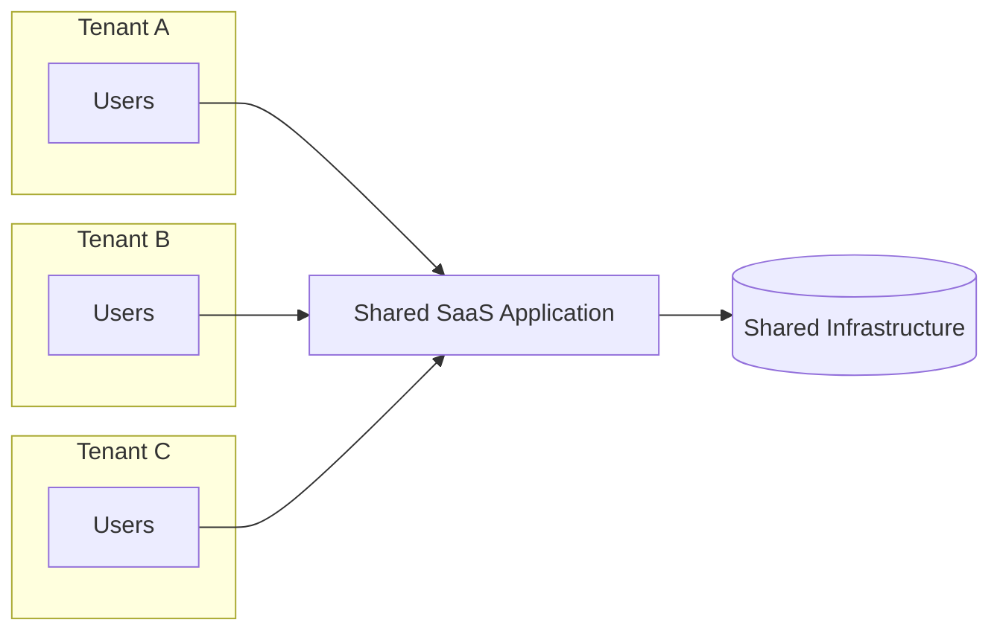

The shared infrastructure may include:

- Application servers
- Databases
- Cache
- Object storage
- Background workers
- Monitoring systems

The challenge is ensuring that every request only interacts with resources belonging to its own tenant.

This isolation must be enforced consistently across every layer of the system.

---

# Single-Tenant vs Multi-Tenant

Choosing between single-tenancy and multi-tenancy is one of the earliest architectural decisions made when building a SaaS product.

Neither approach is universally better.

Each optimizes for different priorities.

## Single-Tenant Architecture

In a single-tenant architecture, every customer owns dedicated infrastructure.

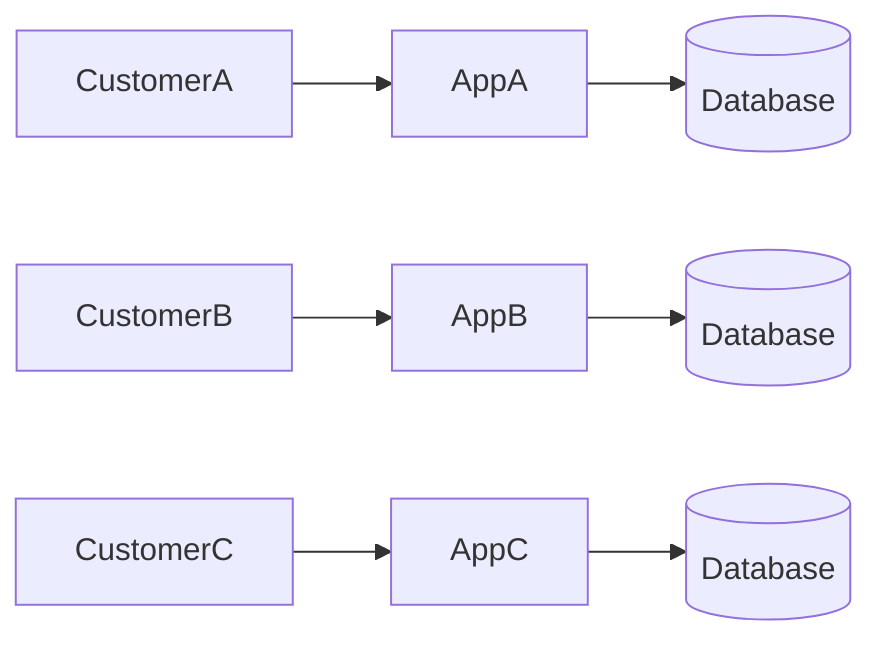

Each deployment is completely independent.

Advantages include:

- Strong isolation
- Independent deployments
- Easier compliance
- Independent scaling
- Per-customer maintenance

Disadvantages include:

- High infrastructure cost
- Operational overhead
- Slower onboarding
- More difficult maintenance
- Lower resource utilization

Single-tenancy is common for highly regulated industries or premium enterprise offerings.

---

## Multi-Tenant Architecture

In a multi-tenant architecture, customers share infrastructure while remaining logically isolated.

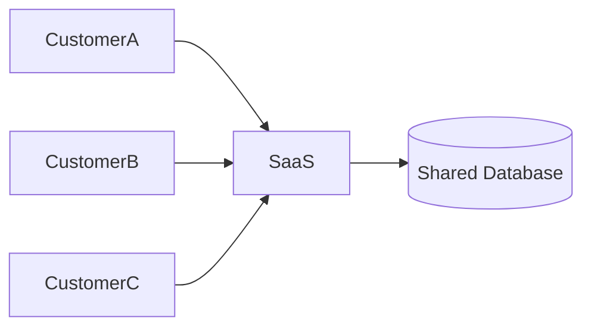

Instead of isolating infrastructure, the application isolates data.

Advantages include:

- Lower operating costs
- Easier deployment
- Better resource utilization
- Faster customer onboarding
- Simplified maintenance

The primary disadvantage is increased engineering complexity.

Every request must be processed with tenant awareness.

---

## Comparison

| Characteristic | Single-Tenant | Multi-Tenant |
|----------------|--------------|--------------|
| Infrastructure Cost | High | Low |
| Resource Utilization | Low | High |
| Deployment Complexity | High | Low |
| Operational Overhead | High | Moderate |
| Customer Isolation | Excellent | Depends on Design |
| Maintenance | Per Customer | Shared |
| Customer Onboarding | Slower | Faster |
| Scalability | Per Customer | Centralized |

The correct choice depends on product requirements, regulatory obligations, operational resources, and business goals.

---

# Why Multi-Tenancy Exists

The primary motivation behind multi-tenancy is **economics**.

Running infrastructure is expensive.

Every additional application requires:

- Compute resources
- Storage
- Monitoring
- Networking
- Maintenance
- Security updates
- Deployment automation

If every customer receives dedicated infrastructure, operating costs increase almost linearly as the customer base grows.

Multi-tenancy changes this model.

Instead of duplicating infrastructure, customers share common resources.

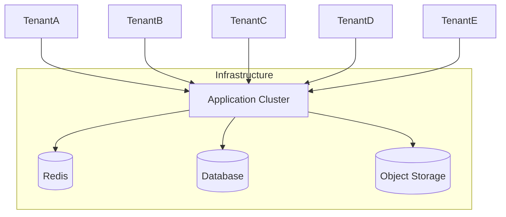

Sharing infrastructure provides several important advantages:

- Reduced operational cost
- Improved hardware utilization
- Faster deployments
- Simpler monitoring
- Easier upgrades
- Lower maintenance effort
- Faster customer onboarding

However, sharing infrastructure introduces new responsibilities.

The application must now ensure:

- Data isolation
- Secure authentication
- Tenant-aware authorization
- Tenant-aware caching
- Tenant-aware logging
- Tenant-aware background processing
- Fair resource usage

In other words, multi-tenancy trades operational simplicity for engineering complexity.

A well-designed architecture embraces this trade-off while ensuring that customers never experience its underlying complexity.

---

# Core Concepts

Before exploring implementation details, it's important to establish a common vocabulary. These terms appear frequently throughout this article and in many production SaaS systems.

## Tenant

A **tenant** is the highest-level business entity within a multi-tenant application.

A tenant usually represents an organization rather than an individual user.

Examples include:

- A company using a CRM platform
- A school using a learning management system
- A sports club using a tournament management platform
- A hospital using a patient management system

A tenant owns data, users, configuration, subscriptions, and resources.

```
Tenant
├── Users
├── Teams
├── Players
├── Tournaments
├── Settings
└── Billing
```

Everything inside the tenant belongs exclusively to that organization.

---

## User

A **user** is an individual capable of authenticating with the application.

A user is **not** the same as a tenant.

For example:

| User | Tenant |
|-------|---------|
| Alice | Club Alpha |
| Bob | Club Alpha |
| Charlie | Club Beta |

One tenant usually contains many users.

Some applications also allow one user to belong to multiple tenants.

For example:

```
Alice

├── Club Alpha (Admin)
├── Club Bravo (Coach)
└── Club Charlie (Player)
```

This is common in:

- Slack
- Notion
- GitHub
- Microsoft Teams

Supporting multiple tenant memberships introduces additional complexity, which will be discussed later in this article.

---

## Membership

A membership defines the relationship between a user and a tenant.

Instead of storing tenant information directly on the user, many systems introduce a join table.

```
Users

Alice
Bob
Charlie

        │

        ▼

Memberships

Alice → Club Alpha → Admin

Bob → Club Alpha → Coach

Charlie → Club Beta → Player
```

This model enables:

- Multiple organizations per user
- Different roles per organization
- Easier invitation workflows
- Flexible permission management

---

## Tenant Context

One of the most important concepts in multi-tenant systems is **tenant context**.

Tenant context represents the tenant currently associated with a request.

Every operation performed by the application should use this context.

```
Incoming Request

        │

        ▼

Tenant Resolution

        │

        ▼

Tenant Context = Club Alpha

        │

        ▼

Business Logic

        │

        ▼

Database Query
```

Once tenant context has been established, it should remain available throughout the lifetime of the request.

Losing tenant context can lead to incorrect authorization, cache pollution, or, in the worst case, cross-tenant data exposure.

---

## Resource Ownership

Every business object should have a clearly defined owner.

For example:

```
Club Alpha

├── Players
├── Coaches
├── Tournaments
├── Courts
└── Invoices
```

A player belonging to Club Alpha should never appear inside Club Beta.

This sounds obvious, but maintaining ownership consistently becomes increasingly difficult as applications grow.

---

# Tenant Lifecycle

A tenant is more than a row in a database.

Throughout its lifetime, a tenant progresses through several operational stages.

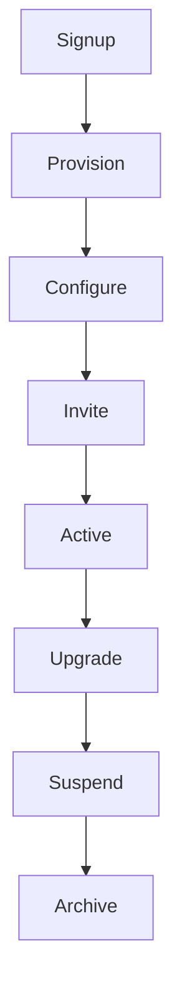

Each stage introduces different architectural concerns.

---

## 1. Signup

The lifecycle begins when a customer creates a new organization.

Typical actions include:

- Choosing an organization name
- Selecting a subscription plan
- Creating the first administrator
- Accepting terms of service

At this stage, very little infrastructure exists.

---

## 2. Provisioning

After signup, the platform prepares resources for the new tenant.

Depending on the chosen architecture, provisioning may include:

- Creating database records
- Creating a schema
- Creating a dedicated database
- Creating storage buckets
- Initializing configuration
- Creating default roles

Provisioning should be automated.

Manual provisioning quickly becomes impossible as the platform grows.

---

## 3. Configuration

After resources exist, the tenant customizes the platform.

Typical configuration includes:

- Organization profile
- Branding
- Languages
- Time zone
- Notification preferences
- Billing information

Many SaaS platforms also create default data during this stage.

Examples include:

- Default roles
- Default permissions
- Example projects
- Example tournaments

---

## 4. Active Usage

This is the longest stage of the tenant lifecycle.

Daily operations include:

- User authentication
- CRUD operations
- Background jobs
- Notifications
- Reporting
- Billing
- Monitoring

Most architectural discussions focus on this stage because it represents normal production traffic.

---

## 5. Upgrade

As customers grow, their infrastructure requirements often change.

Examples include:

- More storage
- More users
- Higher API limits
- Premium features
- Dedicated infrastructure

Well-designed SaaS applications allow upgrades without downtime.

---

## 6. Suspension

Sometimes access must be temporarily disabled.

Reasons include:

- Failed payments
- Compliance issues
- Customer requests
- Security incidents

Suspension should prevent access without deleting customer data.

---

## 7. Archive or Deletion

Eventually a tenant may leave the platform.

Possible actions include:

- Export data
- Archive records
- Remove user access
- Delete infrastructure
- Retain data according to legal requirements

Deletion should be a carefully controlled process with appropriate retention policies.

---

# Tenant Identification

Before the application can enforce isolation, it must determine **which tenant the incoming request belongs to**.

This process is known as **tenant identification** or **tenant resolution**.

It is one of the earliest steps in request processing.

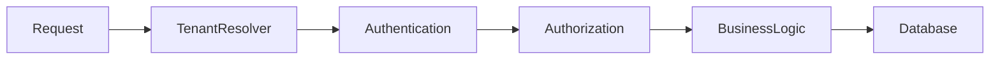

Everything that follows depends on correctly identifying the tenant.

---

## Subdomain-Based Identification

One of the most common approaches uses subdomains.

```
https://club-alpha.example.com
```

The application extracts the tenant identifier from the hostname.

```
club-alpha.example.com

↑

Tenant Identifier
```

### Advantages

- Professional URLs
- Easy branding
- Supports custom domains
- Widely adopted by SaaS platforms

### Disadvantages

- Requires wildcard DNS
- SSL certificate management
- Slightly more complicated local development

### Best For

- Production SaaS products
- Enterprise applications
- White-label platforms

---

## URL Path

Some applications include the tenant inside the URL.

```
https://example.com/club-alpha
```

### Advantages

- Easy implementation
- Simple local development
- No wildcard DNS

### Disadvantages

- Less professional
- Harder migration to custom domains
- More complicated routing

### Best For

- MVPs
- Internal applications
- Small SaaS products

---

## Custom Domains

Enterprise customers often want to use their own domains.

```
https://portal.clubalpha.com
```

or

```
https://play.clubalpha.com
```

Internally, the platform maps the domain to a tenant.

```
portal.clubalpha.com

        │

        ▼

Tenant Lookup

        │

        ▼

Club Alpha
```

Although this creates an excellent user experience, it increases operational complexity.

The platform must manage:

- DNS verification
- SSL certificates
- Domain ownership
- Renewals

---

## JWT Claims

Instead of using the URL, the tenant identifier can be embedded inside the access token.

Example payload:

```json
{
  "sub": "user-123",
  "tenantId": "club-alpha",
  "role": "admin"
}
```

This approach is particularly common for APIs and mobile applications.

However, if users can switch organizations, a new token typically needs to be issued.

---

## Request Headers

Internal services sometimes pass tenant information using headers.

```
X-Tenant-ID: club-alpha
```

This approach is useful for service-to-service communication.

Public clients should generally **not** be trusted to provide tenant identifiers directly.

Instead, the server should derive tenant context from trusted information whenever possible.

---

# Tenant Isolation Models

Once a tenant has been identified, the next architectural decision is determining **how tenant data is isolated**.

This is arguably the most important decision in a multi-tenant system.

There are three widely adopted models.

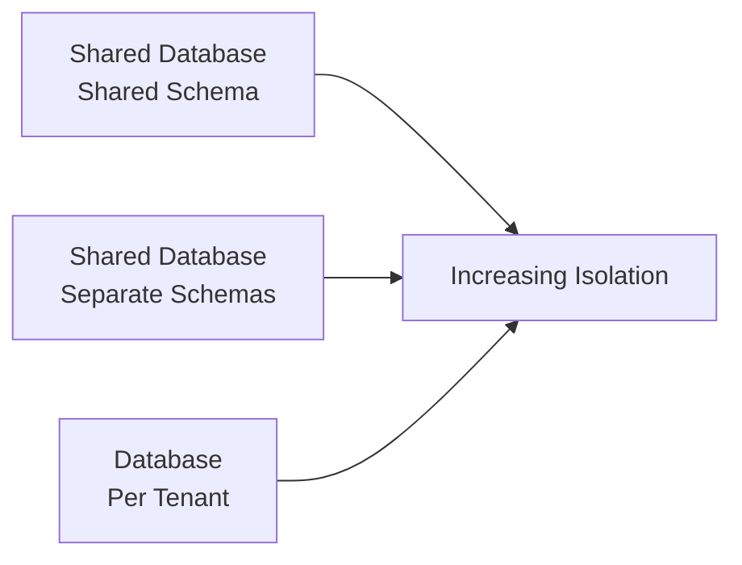

Each model optimizes different priorities.

| Priority | Shared Schema | Separate Schemas | Database per Tenant |
|----------|---------------|------------------|---------------------|
| Cost | ⭐⭐⭐ | ⭐⭐ | ⭐ |
| Isolation | ⭐ | ⭐⭐ | ⭐⭐⭐ |
| Operational Simplicity | ⭐⭐⭐ | ⭐⭐ | ⭐ |
| Enterprise Readiness | ⭐ | ⭐⭐ | ⭐⭐⭐ |

There is no universally correct architecture.

The best choice depends on business requirements, customer expectations, regulatory constraints, and operational maturity.

---

# Shared Database, Shared Schema

The **Shared Database, Shared Schema** model is the most common architecture for early-stage SaaS applications.

In this model, every tenant shares:

- The same application
- The same database
- The same tables

Instead of creating separate tables for each tenant, every record is associated with a tenant identifier.

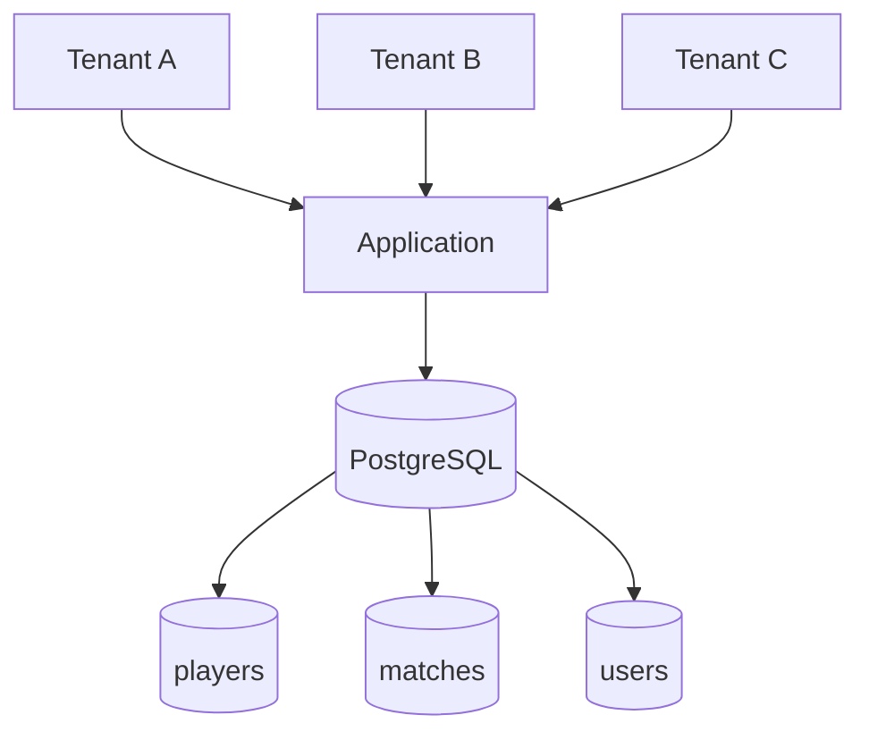

A typical table looks like this:

| id | tenant_id | name |
|----|-----------|------|
| 1 | club-alpha | Alice |
| 2 | club-alpha | Bob |
| 3 | club-beta | Charlie |

Every query **must** include the tenant identifier.

```sql
SELECT *
FROM players
WHERE tenant_id = 'club-alpha';
```

The application should never execute business queries without tenant filtering.

---

## Advantages

### Lowest Infrastructure Cost

Only one database needs to be maintained regardless of the number of tenants.

This keeps cloud costs low and makes the architecture attractive for startups.

---

### Simple Operations

Because every tenant shares the same infrastructure, operational tasks become significantly easier.

Examples include:

- Database migrations
- Backups
- Monitoring
- Infrastructure provisioning
- Deployment

The engineering team only manages one environment.

---

### Excellent Resource Utilization

Resources are shared efficiently.

Inactive tenants consume very little infrastructure while busy tenants can utilize unused capacity.

---

### Fast Tenant Provisioning

Creating a new tenant usually requires inserting a few database records.

Provisioning often completes in seconds.

---

## Disadvantages

### Risk of Cross-Tenant Data Exposure

The biggest disadvantage is the possibility of missing tenant filters.

Consider the following query.

```sql
SELECT *
FROM players;
```

Without a tenant filter, every tenant's data is returned.

This is one of the most common security bugs in multi-tenant applications.

---

### Noisy Neighbor Problem

Since all tenants share the same database, one tenant can consume excessive resources.

Examples include:

- Expensive reports
- Large imports
- Heavy analytics
- Poorly optimized queries

These workloads can negatively affect other tenants.

---

### Compliance Limitations

Some enterprise customers require dedicated databases for legal or regulatory reasons.

Shared databases may not satisfy these requirements.

---

## Best Practices

- Every table should include `tenant_id`.
- Apply tenant filtering automatically whenever possible.
- Prevent developers from bypassing tenant isolation.
- Include `tenant_id` in indexes.
- Use database constraints where appropriate.
- Consider PostgreSQL Row Level Security for additional protection.

---

## Common Mistakes

### Forgetting Tenant Filters

This is by far the most common mistake.

Developers often remember tenant filtering during feature development but accidentally omit it when writing:

- Reports
- Admin dashboards
- Background jobs
- Export functionality

---

### Trusting the Client

Never trust a tenant identifier supplied directly by the frontend.

The server should determine tenant context independently.

---

### Shared Cache Keys

Avoid cache keys like:

```
players
```

Instead use:

```
tenant:club-alpha:players
```

Otherwise cached data may leak between tenants.

---

## When Should You Choose This Model?

Shared Schema is an excellent choice when:

- Building an MVP
- Launching a startup
- Supporting hundreds or thousands of tenants
- Infrastructure cost is a priority
- Compliance requirements are moderate

Many successful SaaS products begin with this architecture.

---

# Shared Database, Separate Schemas

Instead of sharing tables, each tenant receives its own schema within the same database.

```
PostgreSQL

├── tenant_alpha
│   ├── users
│   ├── players
│   └── tournaments
│
├── tenant_beta
│   ├── users
│   ├── players
│   └── tournaments
│
└── tenant_gamma
    ├── users
    ├── players
    └── tournaments
```

Although the database server is shared, each tenant's tables are isolated.

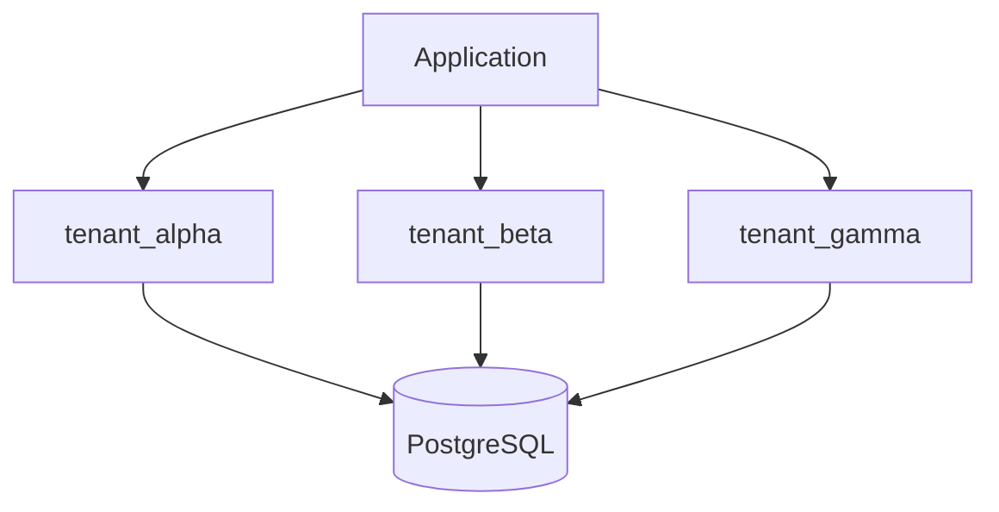

---

## Advantages

### Better Isolation

Developers cannot accidentally query another tenant's table simply by forgetting a filter.

Each tenant owns separate tables.

---

### Easier Backup and Restore

Because each tenant has its own schema, restoring a single customer becomes much easier than restoring an entire shared database.

---

### Cleaner Database Organization

Large tenants remain logically separated, making administration easier.

---

## Disadvantages

### Schema Migrations Become Harder

Every schema must receive identical migrations.

Instead of updating one schema, migrations now run hundreds or thousands of times.

---

### Operational Complexity

Managing:

- Schema creation
- Schema deletion
- Schema versioning

becomes increasingly difficult as the platform grows.

---

### Connection Management

Applications must determine which schema should be active before executing queries.

This adds complexity to database access layers.

---

## Best Practices

- Automate schema creation.
- Automate migrations.
- Keep every schema on the same version.
- Monitor migration failures carefully.

---

## When Should You Choose This Model?

This architecture works well for:

- Medium-sized SaaS companies
- Enterprise products
- Moderate compliance requirements
- Hundreds of large customers

---

# Database Per Tenant

Database Per Tenant provides the strongest level of isolation.

Each tenant receives an entirely independent database.

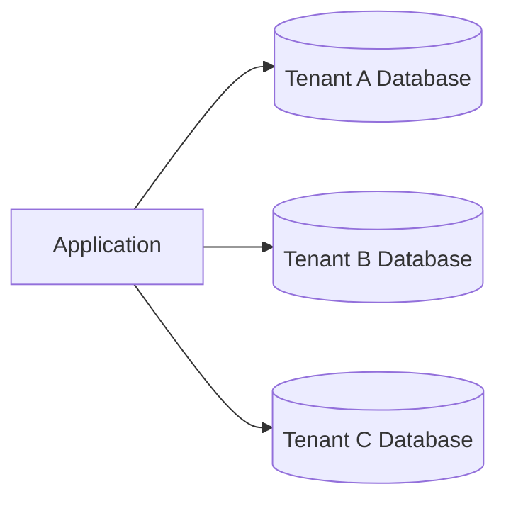

No customer shares storage with another customer.

---

## Advantages

### Maximum Isolation

Every tenant owns:

- Database
- Backups
- Performance profile

Cross-tenant data leaks caused by SQL queries become significantly less likely.

---

### Independent Scaling

Large enterprise customers can scale independently.

One customer's workload cannot impact another's database.

---

### Easier Compliance

Many regulations become easier to satisfy when customers own dedicated databases.

Examples include:

- Financial systems
- Healthcare platforms
- Government applications

---

### Per-Tenant Maintenance

Individual databases can be:

- Upgraded
- Backed up
- Restored
- Migrated

without affecting other customers.

---

## Disadvantages

### Highest Infrastructure Cost

Every tenant requires:

- Database server resources
- Monitoring
- Backup storage
- Maintenance

Infrastructure costs increase substantially.

---

### Operational Overhead

Provisioning databases, applying migrations, rotating credentials, and monitoring thousands of databases require significant automation.

---

### Increased Complexity

Application routing becomes more sophisticated because the application must determine which database should receive each request.

---

## Best Practices

- Automate provisioning.
- Automate credential management.
- Automate migrations.
- Centralize monitoring.
- Maintain a tenant registry describing database locations.

---

## When Should You Choose This Model?

Database Per Tenant is most appropriate for:

- Enterprise SaaS
- Government platforms
- Healthcare
- Banking
- High-value enterprise customers

---

# Comparing Isolation Models

| Feature | Shared Schema | Separate Schemas | Database per Tenant |
|---------|---------------|------------------|---------------------|
| Infrastructure Cost | Low | Medium | High |
| Operational Complexity | Low | Medium | High |
| Customer Isolation | Good | Better | Best |
| Scalability | Excellent | Good | Good |
| Backup Granularity | Whole Database | Per Schema | Per Database |
| Compliance | Moderate | Good | Excellent |
| Startup Friendly | Excellent | Good | Poor |
| Enterprise Friendly | Moderate | Good | Excellent |

The important takeaway is that **no model is universally superior**.

Each represents a different balance between simplicity, cost, operational complexity, and isolation.

---

# Hybrid Architecture

Many successful SaaS companies do **not** stay with one isolation model forever.

Instead, they evolve as their customer base grows.

A common progression looks like this:

```text
Startup
    │
    ▼
Shared Database
    │
    ▼
Growing SaaS
    │
    ▼
Separate Schemas
    │
    ▼
Enterprise Customers
    │
    ▼
Dedicated Databases
```

Small customers share infrastructure because doing so is cost-effective.

Large enterprise customers receive dedicated infrastructure when justified by:

- Performance
- Compliance
- Service Level Agreements (SLAs)
- Security requirements

This hybrid approach balances operational efficiency with customer-specific requirements.

A routing layer determines where each tenant's data resides.

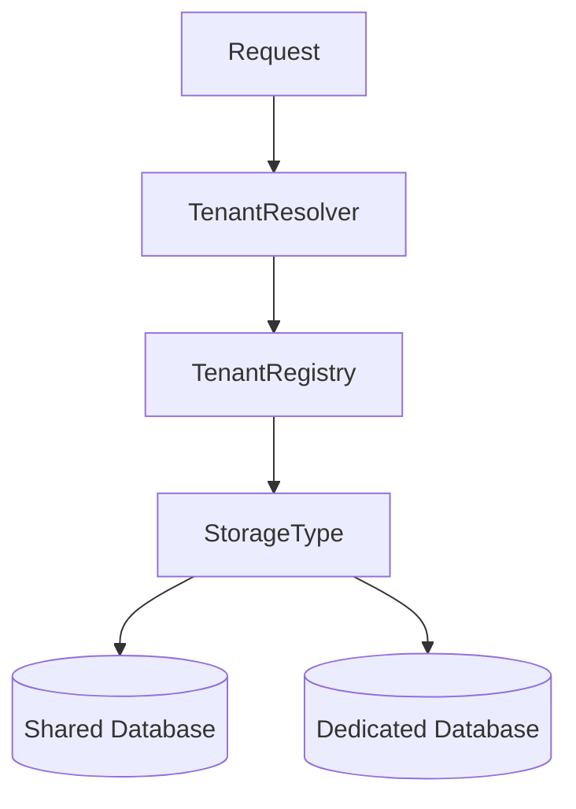

The tenant registry stores metadata describing each tenant, including:

- Tenant identifier
- Subscription plan
- Database connection
- Region
- Storage model
- Feature flags

The application uses this information to route requests transparently.

From the user's perspective, nothing changes.

Regardless of whether their data is stored in a shared database or a dedicated database, the application behaves identically.

This ability to evolve infrastructure without changing the user experience is one of the defining characteristics of well-designed SaaS platforms.

---

# Request Flow

Regardless of the tenant isolation model, every request should follow a predictable processing pipeline.

Establishing a consistent request flow improves security, maintainability, and observability.

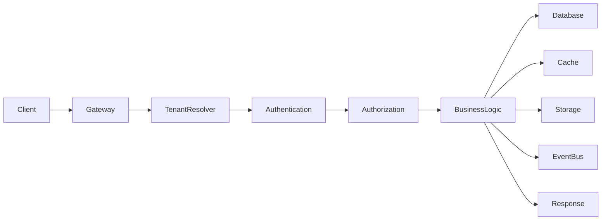

Each stage has a distinct responsibility.

| Step | Responsibility |
|------|----------------|
| API Gateway | Receives incoming requests |
| Tenant Resolver | Determines the active tenant |
| Authentication | Verifies user identity |
| Authorization | Checks permissions |
| Business Logic | Executes application rules |
| Database | Reads and writes tenant data |
| Event Bus | Publishes domain events |
| Response | Returns results to the client |

Keeping these responsibilities separate simplifies testing and reduces coupling.

---

## Step 1 — API Gateway

The API Gateway is the application's entry point.

Typical responsibilities include:

- HTTPS termination
- Request routing
- Rate limiting
- Logging
- Request validation
- Distributed tracing

Importantly, the gateway **should not contain business logic**.

Instead, it prepares requests for downstream services.

---

## Step 2 — Tenant Resolution

Before authentication or business logic executes, the application determines which tenant the request belongs to.

Depending on the architecture, this information may come from:

- Subdomain
- Custom domain
- URL path
- JWT claims
- Internal routing metadata

Example:

```
https://club-alpha.example.com
```

↓

```
Tenant = club-alpha
```

The resolved tenant should be attached to the request context.

For example:

```text
Request Context

Tenant ID: club-alpha
Request ID: 7fc91...
User ID: pending authentication
```

From this point forward, every component should use the same tenant context.

---

## Step 3 — Authentication

Authentication answers one question:

> Who is making this request?

Typical authentication methods include:

- Username and password
- OAuth 2.0
- OpenID Connect
- Single Sign-On (SSO)
- API Keys
- JWT access tokens

Authentication verifies identity.

It does **not** determine what the user is allowed to do.

---

## Step 4 — Authorization

Authorization answers a different question:

> Is this authenticated user allowed to perform this action within the current tenant?

Authorization typically evaluates:

- User role
- Assigned permissions
- Tenant membership
- Resource ownership

For example:

```
Alice

↓

Club Alpha

↓

Role = Tournament Admin

↓

Can Create Tournament = Yes
```

Whereas:

```
Alice

↓

Club Beta

↓

Role = Viewer

↓

Can Create Tournament = No
```

Notice that permissions are evaluated **within a tenant**, not globally.

This distinction is critical in multi-tenant systems where users may belong to multiple organizations.

---

## Step 5 — Business Logic

Once the request has passed authentication and authorization, the application executes business logic.

Examples include:

- Creating tournaments
- Registering players
- Updating rankings
- Scheduling matches
- Processing invoices

Business logic should never need to determine the current tenant.

It should simply consume the tenant context established earlier in the request pipeline.

This separation makes application code significantly easier to understand.

---

## Step 6 — Data Access

Every database operation must be tenant-aware.

Instead of:

```sql
SELECT *
FROM tournaments;
```

Applications should execute:

```sql
SELECT *
FROM tournaments
WHERE tenant_id = :tenantId;
```

Ideally, developers should not write tenant filtering manually.

Instead, use a repository layer, ORM global filters, or Row Level Security (RLS) to enforce isolation automatically.

---

# Authentication and Authorization

Authentication and authorization are often discussed together, but they solve different problems.

| Authentication | Authorization |
|---------------|---------------|
| Who are you? | What are you allowed to do? |
| Identity | Permissions |
| Login | Access Control |

Confusing these concepts often results in security vulnerabilities.

---

## Authentication in Multi-Tenant Systems

Authentication verifies identity independently of tenant permissions.

For example:

```
Email

↓

Password

↓

User Verified
```

At this point, the application knows who the user is.

It still does **not** know which organization the user wants to access.

If users belong to multiple organizations, an additional tenant selection step may be required.

```
Alice

↓

Authenticated

↓

Choose Organization

├── Club Alpha
├── Club Bravo
└── Club Delta
```

Only after selecting a tenant can authorization begin.

---

## Tenant Membership

Many SaaS applications model user access using a membership table.

```text
Users

↓

Memberships

↓

Tenants
```

Example:

| User | Tenant | Role |
|------|---------|------|
| Alice | Club Alpha | Admin |
| Alice | Club Bravo | Coach |
| Bob | Club Alpha | Player |

This design supports:

- Multiple organizations
- Different roles
- Organization invitations
- Easy permission management

---

## Role-Based Access Control (RBAC)

Role-Based Access Control groups permissions into reusable roles.

Example:

```
Admin

├── Create Tournament
├── Delete Tournament
├── Invite Users
└── Manage Billing
```

```
Coach

├── Create Match
├── Update Scores
└── View Players
```

```
Player

├── View Schedule
└── Update Profile
```

Instead of assigning hundreds of permissions directly to users, the application assigns roles.

This greatly simplifies administration.

---

## Fine-Grained Permissions

As systems grow, roles alone are often insufficient.

Consider:

```
Tournament Admin

Can edit tournaments?

YES

Only tournaments belonging to Club Alpha?

YES

Only tournaments created this season?

YES
```

Fine-grained permission systems evaluate:

- Resource ownership
- Tenant ownership
- Team ownership
- Department
- Subscription plan

These rules are evaluated after authentication.

---

# Data Isolation

The primary responsibility of a multi-tenant architecture is preventing one tenant from accessing another tenant's data.

Data isolation should never depend on developer discipline alone.

Instead, it should be enforced at multiple layers.

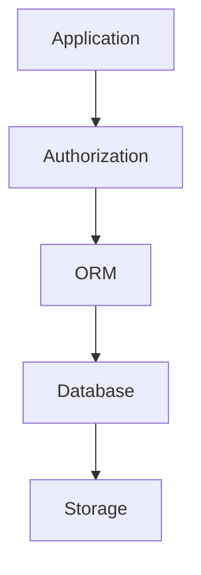

Each layer reinforces the previous one.

This concept is known as **defense in depth**.

---

## Application Layer

The application validates:

- Tenant membership
- User permissions
- Resource ownership

Business logic should reject unauthorized requests before they reach the database.

---

## ORM Layer

Many Object-Relational Mapping (ORM) frameworks support global query filters.

Instead of requiring developers to remember tenant filtering, the ORM automatically injects:

```sql
WHERE tenant_id = :tenantId
```

This significantly reduces the likelihood of accidental data leaks.

---

## Database Layer

The database should also participate in tenant isolation.

For example:

- Foreign key constraints
- Check constraints
- Unique composite indexes
- Row Level Security

The database should never assume the application is always correct.

---

# Row Level Security (RLS)

Some relational databases, such as PostgreSQL, support Row Level Security (RLS).

Instead of trusting application code, the database itself decides which rows may be accessed.

```mermaid
flowchart LR

Application-->PostgreSQL-->RLSPolicy-->Rows Returned
```

Example policy:

```
Users may only access rows
where tenant_id equals
their current tenant.
```

Even if a developer accidentally writes:

```sql
SELECT *
FROM players;
```

The database still filters rows according to the active policy.

This dramatically reduces the risk of cross-tenant data exposure.

---

## Benefits of Row Level Security

- Strong defense against programming mistakes
- Centralized security rules
- Simplified application code
- Better compliance
- Additional protection for administrative queries

Although RLS introduces additional planning and testing, it is an excellent choice for security-sensitive SaaS platforms.

---

# Database Design

Good database design makes multi-tenancy easier to maintain as the application grows.

A typical shared-schema design includes tenant ownership on every business table.

Example:

```text
tenants

users

memberships

players

tournaments

matches

payments
```

Relationships:

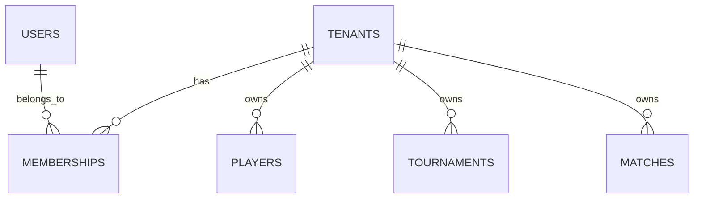

Notice that business entities belong to tenants rather than directly to users.

This simplifies ownership when users change roles or leave the organization.

---

## Indexing

Nearly every query filters using `tenant_id`.

Therefore, indexing this column is essential.

Instead of:

```sql
INDEX(name)
```

consider:

```sql
INDEX(tenant_id, name)
```

Composite indexes often perform significantly better for tenant-scoped queries.

Design indexes based on actual query patterns rather than adding them indiscriminately.

---
