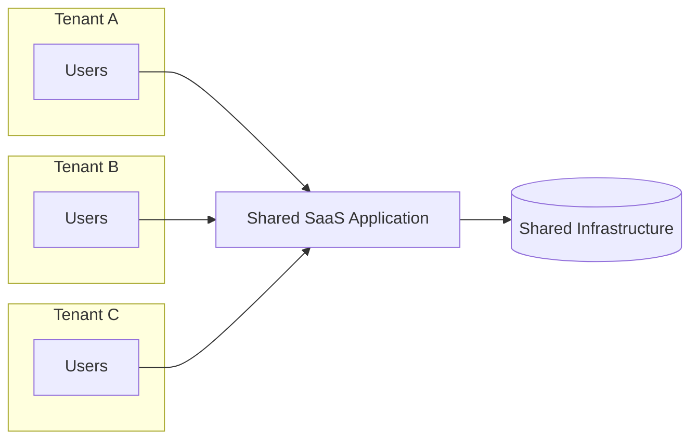
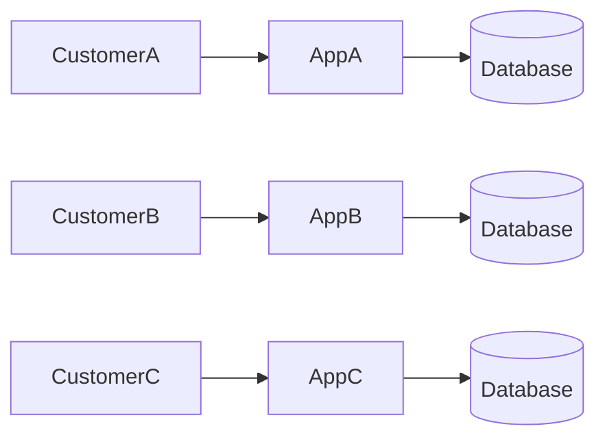
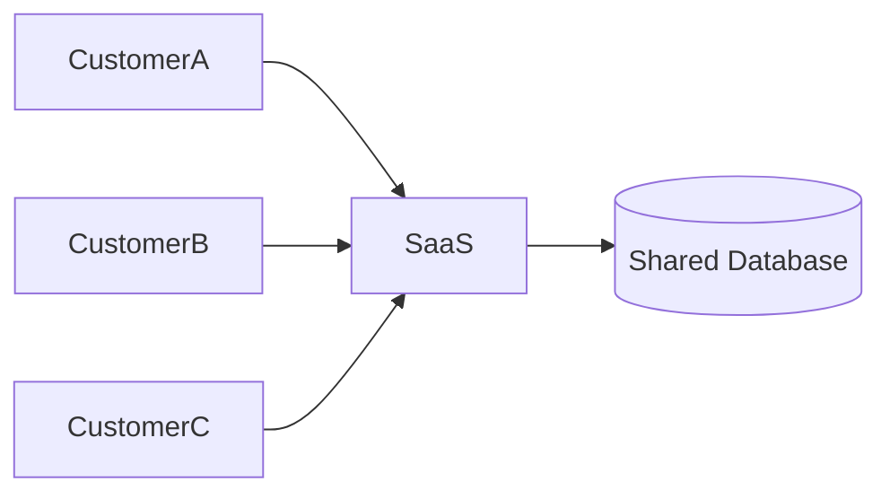
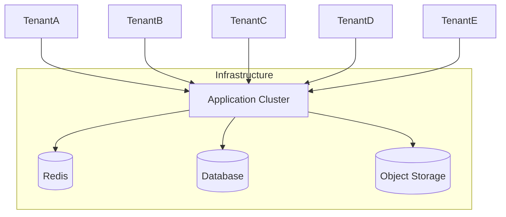
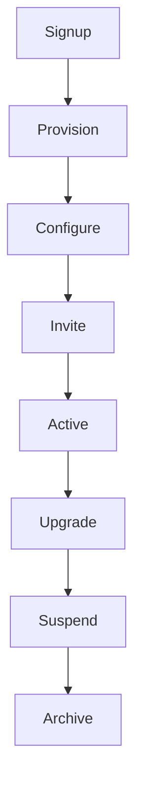
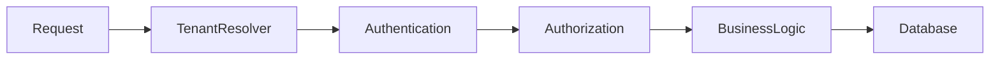
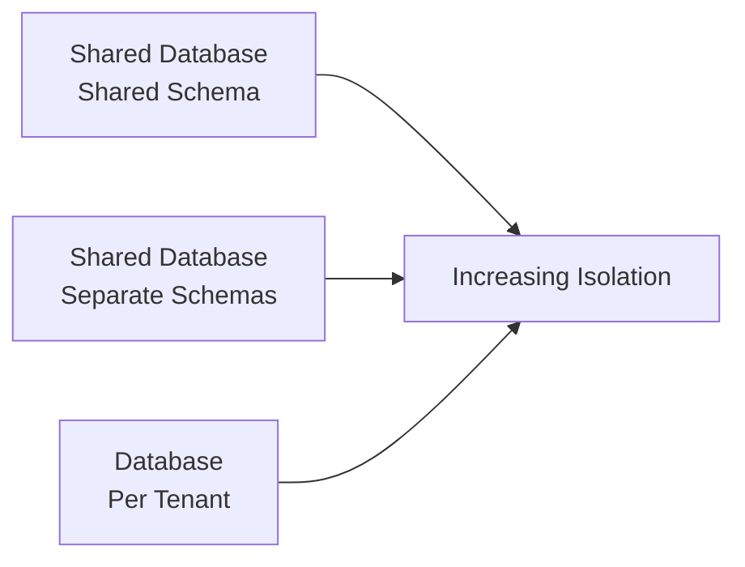

# Multi-Tenant SaaS Architecture

> A practical guide to designing, building, and scaling production-ready multi-tenant Software-as-a-Service (SaaS) applications.

---

## Overview

Multi-tenancy is one of the most important architectural concepts in modern SaaS development. Nearly every successful B2B SaaS platform—from project management tools and e-commerce platforms to CRM systems and collaboration software—must solve the same fundamental problem:

> **How can thousands of independent customers share the same application while ensuring their data remains completely isolated?**

At first glance, the solution appears simple: add a `tenant_id` column to every table and filter queries accordingly.

In reality, multi-tenancy influences almost every architectural decision within a system.

A multi-tenant application must consider:

- Authentication
- Authorization
- Database design
- API design
- Caching
- Background jobs
- File storage
- Event-driven architecture
- Monitoring
- Deployment
- Security
- Scalability

A mistake in any one of these areas can result in data leaks, security vulnerabilities, operational complexity, or poor scalability.

This article explains how production SaaS applications are designed, the trade-offs behind different architectural choices, and how systems typically evolve as the number of customers grows.

Although examples throughout this article reference a racket sports club management platform, the concepts apply to virtually any multi-tenant SaaS application.

---

## Learning Objectives

After reading this article, you should be able to:

- Explain what multi-tenancy is and why it exists.
- Compare single-tenant and multi-tenant architectures.
- Understand the most common tenant isolation strategies.
- Design secure tenant-aware applications.
- Choose an appropriate database architecture.
- Understand how authentication, authorization, caching, and infrastructure are affected by multi-tenancy.
- Recognize common mistakes made in production systems.
- Evaluate architectural trade-offs as a SaaS platform scales.

---

## Table of Contents

1. Introduction
2. The Problem
3. What Is Multi-Tenancy?
4. Single-Tenant vs Multi-Tenant
5. Why Multi-Tenancy Exists
6. Core Concepts
7. Tenant Lifecycle
8. Tenant Identification
9. Tenant Isolation Models
10. Shared Database, Shared Schema
11. Shared Database, Separate Schemas
12. Database per Tenant
13. Hybrid Architecture
14. Request Flow
15. Authentication & Authorization
16. Data Isolation
17. Database Design
18. Caching Strategy
19. File Storage
20. Background Jobs
21. Event-Driven Architecture
22. Scaling Strategy
23. Monitoring & Observability
24. Security Best Practices
25. Migration Strategies
26. Common Mistakes
27. Decision Matrix
28. Real-World Examples
29. Key Takeaways
30. Related Articles

---

# Introduction

Modern SaaS platforms are expected to serve anywhere from a handful of customers to hundreds of thousands of organizations while remaining secure, reliable, and cost-effective.

Imagine building software for managing racket sports clubs.

Your first customer signs up.

```
Club Alpha
```

Everything is simple.

A few weeks later, additional clubs join.

```
Club Alpha
Club Beta
Club Gamma
```

A year later, your platform has grown significantly.

```
Club Alpha
Club Beta
Club Gamma
...
Club #5,000
```

Each club expects:

- Private player information
- Independent tournaments
- Separate billing
- Organization-specific settings
- Reliable performance
- Secure authentication

From the customer's perspective, the application should feel as though it was built exclusively for them.

From the engineering team's perspective, maintaining 5,000 completely separate applications would be operationally impossible.

This challenge is the foundation of multi-tenant architecture.

Instead of deploying an independent application for every customer, a single application instance serves many organizations while enforcing strict logical separation between them.

Designing that separation correctly is one of the most important architectural responsibilities in a SaaS platform.

---

# The Problem

Before discussing architecture, it's important to understand **why multi-tenancy exists**.

Suppose every customer receives their own application.

```text
Customer A
    │
    ▼
Application A
    │
    ▼
Database A

Customer B
    │
    ▼
Application B
    │
    ▼
Database B

Customer C
    │
    ▼
Application C
    │
    ▼
Database C
```

Initially, this approach appears attractive.

Each customer is completely isolated.

There is no possibility of accidentally reading another customer's data.

However, as the platform grows, operational complexity increases dramatically.

With 1,000 customers, the engineering team would manage:

- 1,000 application deployments
- 1,000 databases
- 1,000 monitoring targets
- 1,000 backup schedules
- 1,000 deployment pipelines
- 1,000 upgrade processes

Infrastructure costs increase almost linearly with every new customer.

Even routine maintenance becomes difficult.

Questions such as these become increasingly common:

- How do we deploy a new release?
- How do we monitor every customer?
- How do we roll back failures?
- How do we apply database migrations?
- How do we scale infrastructure?

Managing thousands of isolated environments is possible, but only for products where strong isolation outweighs operational cost.

Examples include:

- Government systems
- Banking platforms
- Healthcare software
- Highly regulated enterprise products

For most SaaS businesses, this approach is neither practical nor economical.

---

# What Is Multi-Tenancy?

Multi-tenancy is an architectural pattern where **a single application serves multiple independent customers while keeping their data logically isolated**.

Each customer is called a **tenant**.

A tenant might represent:

- A company
- A sports club
- A university
- A school
- A hospital
- A government department

Although every tenant shares the same application, they should never be aware that other tenants exist.



The shared infrastructure may include:

- Application servers
- Databases
- Cache
- Object storage
- Background workers
- Monitoring systems

The challenge is ensuring that every request only interacts with resources belonging to its own tenant.

This isolation must be enforced consistently across every layer of the system.

---

# Single-Tenant vs Multi-Tenant

Choosing between single-tenancy and multi-tenancy is one of the earliest architectural decisions made when building a SaaS product.

Neither approach is universally better.

Each optimizes for different priorities.

## Single-Tenant Architecture

In a single-tenant architecture, every customer owns dedicated infrastructure.



Each deployment is completely independent.

Advantages include:

- Strong isolation
- Independent deployments
- Easier compliance
- Independent scaling
- Per-customer maintenance

Disadvantages include:

- High infrastructure cost
- Operational overhead
- Slower onboarding
- More difficult maintenance
- Lower resource utilization

Single-tenancy is common for highly regulated industries or premium enterprise offerings.

---

## Multi-Tenant Architecture

In a multi-tenant architecture, customers share infrastructure while remaining logically isolated.



Instead of isolating infrastructure, the application isolates data.

Advantages include:

- Lower operating costs
- Easier deployment
- Better resource utilization
- Faster customer onboarding
- Simplified maintenance

The primary disadvantage is increased engineering complexity.

Every request must be processed with tenant awareness.

---

## Comparison

| Characteristic | Single-Tenant | Multi-Tenant |
|----------------|--------------|--------------|
| Infrastructure Cost | High | Low |
| Resource Utilization | Low | High |
| Deployment Complexity | High | Low |
| Operational Overhead | High | Moderate |
| Customer Isolation | Excellent | Depends on Design |
| Maintenance | Per Customer | Shared |
| Customer Onboarding | Slower | Faster |
| Scalability | Per Customer | Centralized |

The correct choice depends on product requirements, regulatory obligations, operational resources, and business goals.

---

# Why Multi-Tenancy Exists

The primary motivation behind multi-tenancy is **economics**.

Running infrastructure is expensive.

Every additional application requires:

- Compute resources
- Storage
- Monitoring
- Networking
- Maintenance
- Security updates
- Deployment automation

If every customer receives dedicated infrastructure, operating costs increase almost linearly as the customer base grows.

Multi-tenancy changes this model.

Instead of duplicating infrastructure, customers share common resources.



Sharing infrastructure provides several important advantages:

- Reduced operational cost
- Improved hardware utilization
- Faster deployments
- Simpler monitoring
- Easier upgrades
- Lower maintenance effort
- Faster customer onboarding

However, sharing infrastructure introduces new responsibilities.

The application must now ensure:

- Data isolation
- Secure authentication
- Tenant-aware authorization
- Tenant-aware caching
- Tenant-aware logging
- Tenant-aware background processing
- Fair resource usage

In other words, multi-tenancy trades operational simplicity for engineering complexity.

A well-designed architecture embraces this trade-off while ensuring that customers never experience its underlying complexity.

---

# Core Concepts

Before exploring implementation details, it's important to establish a common vocabulary. These terms appear frequently throughout this article and in many production SaaS systems.

## Tenant

A **tenant** is the highest-level business entity within a multi-tenant application.

A tenant usually represents an organization rather than an individual user.

Examples include:

- A company using a CRM platform
- A school using a learning management system
- A sports club using a tournament management platform
- A hospital using a patient management system

A tenant owns data, users, configuration, subscriptions, and resources.

```
Tenant
├── Users
├── Teams
├── Players
├── Tournaments
├── Settings
└── Billing
```

Everything inside the tenant belongs exclusively to that organization.

---

## User

A **user** is an individual capable of authenticating with the application.

A user is **not** the same as a tenant.

For example:

| User | Tenant |
|-------|---------|
| Alice | Club Alpha |
| Bob | Club Alpha |
| Charlie | Club Beta |

One tenant usually contains many users.

Some applications also allow one user to belong to multiple tenants.

For example:

```
Alice

├── Club Alpha (Admin)
├── Club Bravo (Coach)
└── Club Charlie (Player)
```

This is common in:

- Slack
- Notion
- GitHub
- Microsoft Teams

Supporting multiple tenant memberships introduces additional complexity, which will be discussed later in this article.

---

## Membership

A membership defines the relationship between a user and a tenant.

Instead of storing tenant information directly on the user, many systems introduce a join table.

```
Users

Alice
Bob
Charlie

        │

        ▼

Memberships

Alice → Club Alpha → Admin

Bob → Club Alpha → Coach

Charlie → Club Beta → Player
```

This model enables:

- Multiple organizations per user
- Different roles per organization
- Easier invitation workflows
- Flexible permission management

---

## Tenant Context

One of the most important concepts in multi-tenant systems is **tenant context**.

Tenant context represents the tenant currently associated with a request.

Every operation performed by the application should use this context.

```
Incoming Request

        │

        ▼

Tenant Resolution

        │

        ▼

Tenant Context = Club Alpha

        │

        ▼

Business Logic

        │

        ▼

Database Query
```

Once tenant context has been established, it should remain available throughout the lifetime of the request.

Losing tenant context can lead to incorrect authorization, cache pollution, or, in the worst case, cross-tenant data exposure.

---

## Resource Ownership

Every business object should have a clearly defined owner.

For example:

```
Club Alpha

├── Players
├── Coaches
├── Tournaments
├── Courts
└── Invoices
```

A player belonging to Club Alpha should never appear inside Club Beta.

This sounds obvious, but maintaining ownership consistently becomes increasingly difficult as applications grow.

---

# Tenant Lifecycle

A tenant is more than a row in a database.

Throughout its lifetime, a tenant progresses through several operational stages.



Each stage introduces different architectural concerns.

---

## 1. Signup

The lifecycle begins when a customer creates a new organization.

Typical actions include:

- Choosing an organization name
- Selecting a subscription plan
- Creating the first administrator
- Accepting terms of service

At this stage, very little infrastructure exists.

---

## 2. Provisioning

After signup, the platform prepares resources for the new tenant.

Depending on the chosen architecture, provisioning may include:

- Creating database records
- Creating a schema
- Creating a dedicated database
- Creating storage buckets
- Initializing configuration
- Creating default roles

Provisioning should be automated.

Manual provisioning quickly becomes impossible as the platform grows.

---

## 3. Configuration

After resources exist, the tenant customizes the platform.

Typical configuration includes:

- Organization profile
- Branding
- Languages
- Time zone
- Notification preferences
- Billing information

Many SaaS platforms also create default data during this stage.

Examples include:

- Default roles
- Default permissions
- Example projects
- Example tournaments

---

## 4. Active Usage

This is the longest stage of the tenant lifecycle.

Daily operations include:

- User authentication
- CRUD operations
- Background jobs
- Notifications
- Reporting
- Billing
- Monitoring

Most architectural discussions focus on this stage because it represents normal production traffic.

---

## 5. Upgrade

As customers grow, their infrastructure requirements often change.

Examples include:

- More storage
- More users
- Higher API limits
- Premium features
- Dedicated infrastructure

Well-designed SaaS applications allow upgrades without downtime.

---

## 6. Suspension

Sometimes access must be temporarily disabled.

Reasons include:

- Failed payments
- Compliance issues
- Customer requests
- Security incidents

Suspension should prevent access without deleting customer data.

---

## 7. Archive or Deletion

Eventually a tenant may leave the platform.

Possible actions include:

- Export data
- Archive records
- Remove user access
- Delete infrastructure
- Retain data according to legal requirements

Deletion should be a carefully controlled process with appropriate retention policies.

---

# Tenant Identification

Before the application can enforce isolation, it must determine **which tenant the incoming request belongs to**.

This process is known as **tenant identification** or **tenant resolution**.

It is one of the earliest steps in request processing.



Everything that follows depends on correctly identifying the tenant.

---

## Subdomain-Based Identification

One of the most common approaches uses subdomains.

```
https://club-alpha.example.com
```

The application extracts the tenant identifier from the hostname.

```
club-alpha.example.com

↑

Tenant Identifier
```

### Advantages

- Professional URLs
- Easy branding
- Supports custom domains
- Widely adopted by SaaS platforms

### Disadvantages

- Requires wildcard DNS
- SSL certificate management
- Slightly more complicated local development

### Best For

- Production SaaS products
- Enterprise applications
- White-label platforms

---

## URL Path

Some applications include the tenant inside the URL.

```
https://example.com/club-alpha
```

### Advantages

- Easy implementation
- Simple local development
- No wildcard DNS

### Disadvantages

- Less professional
- Harder migration to custom domains
- More complicated routing

### Best For

- MVPs
- Internal applications
- Small SaaS products

---

## Custom Domains

Enterprise customers often want to use their own domains.

```
https://portal.clubalpha.com
```

or

```
https://play.clubalpha.com
```

Internally, the platform maps the domain to a tenant.

```
portal.clubalpha.com

        │

        ▼

Tenant Lookup

        │

        ▼

Club Alpha
```

Although this creates an excellent user experience, it increases operational complexity.

The platform must manage:

- DNS verification
- SSL certificates
- Domain ownership
- Renewals

---

## JWT Claims

Instead of using the URL, the tenant identifier can be embedded inside the access token.

Example payload:

```json
{
  "sub": "user-123",
  "tenantId": "club-alpha",
  "role": "admin"
}
```

This approach is particularly common for APIs and mobile applications.

However, if users can switch organizations, a new token typically needs to be issued.

---

## Request Headers

Internal services sometimes pass tenant information using headers.

```
X-Tenant-ID: club-alpha
```

This approach is useful for service-to-service communication.

Public clients should generally **not** be trusted to provide tenant identifiers directly.

Instead, the server should derive tenant context from trusted information whenever possible.

---

# Tenant Isolation Models

Once a tenant has been identified, the next architectural decision is determining **how tenant data is isolated**.

This is arguably the most important decision in a multi-tenant system.

There are three widely adopted models.



Each model optimizes different priorities.

| Priority | Shared Schema | Separate Schemas | Database per Tenant |
|----------|---------------|------------------|---------------------|
| Cost | ⭐⭐⭐ | ⭐⭐ | ⭐ |
| Isolation | ⭐ | ⭐⭐ | ⭐⭐⭐ |
| Operational Simplicity | ⭐⭐⭐ | ⭐⭐ | ⭐ |
| Enterprise Readiness | ⭐ | ⭐⭐ | ⭐⭐⭐ |

There is no universally correct architecture.

The best choice depends on business requirements, customer expectations, regulatory constraints, and operational maturity.
