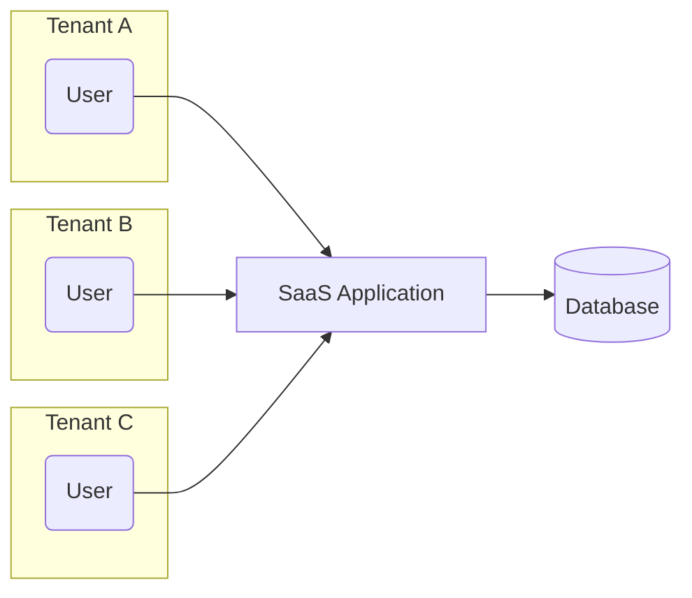
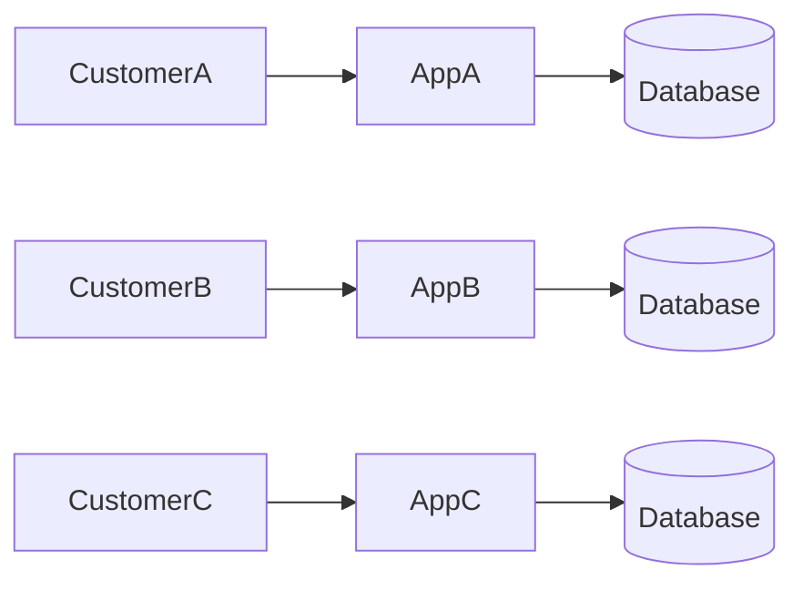
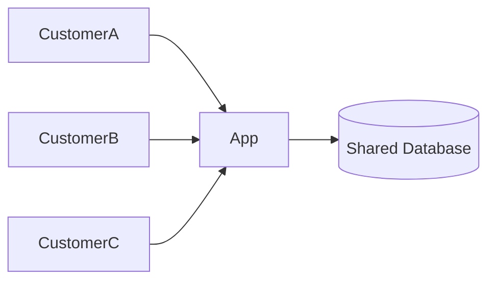
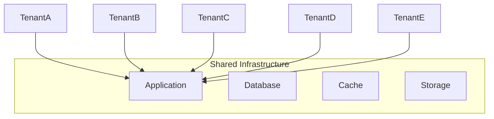

# Multi-Tenant SaaS Architecture

> A practical guide to designing, scaling, and securing multi-tenant Software-as-a-Service (SaaS) applications.

---

## Table of Contents

1. Introduction
2. The Problem
3. What is Multi-Tenancy?
4. Single-Tenant vs Multi-Tenant
5. Why Multi-Tenancy Exists
6. Core Concepts
7. Tenant Lifecycle
8. What's Next

---

# Introduction

Modern Software-as-a-Service (SaaS) platforms are expected to serve anywhere from a handful of customers to thousands of organizations using the same application. While every customer expects their data to remain private and secure, operating a completely separate application for each customer quickly becomes expensive, difficult to maintain, and challenging to scale.

Multi-tenancy solves this problem by allowing multiple customers—called **tenants**—to share the same application while keeping their data logically isolated.

Today, multi-tenancy is the foundation of most B2B SaaS platforms, including products such as Slack, Notion, GitHub, Shopify, and many internal enterprise systems.

Designing a successful multi-tenant application is about much more than adding a `tenant_id` column to database tables. It influences nearly every architectural decision, including:

- Authentication
- Authorization
- Database design
- API design
- Caching
- File storage
- Background jobs
- Event-driven systems
- Monitoring
- Security
- Deployment

This article introduces the core concepts behind multi-tenant architecture and explains the trade-offs involved in designing systems that are secure, scalable, and maintainable.

---

# The Problem

Imagine you are building a SaaS platform for managing racket sports clubs.

After launching, your first customer signs up.

```
Club Alpha
```

A few weeks later, two more clubs join.

```
Club Alpha
Club Beta
Club Gamma
```

After a year, hundreds of clubs are using your platform.

Each club expects:

- Private player information
- Separate tournaments
- Independent billing
- Custom branding
- Secure authentication
- Reliable performance

The challenge is that every club should feel like it owns the application, even though they are all sharing the same software.

At this point, there are two possible approaches.

1. Deploy a completely separate application for every customer.
2. Allow all customers to share the same application while isolating their data.

The first approach provides excellent isolation but becomes increasingly expensive and operationally complex.

The second approach significantly reduces infrastructure costs but requires careful architectural design to prevent data leakage between tenants.

This trade-off is the reason multi-tenancy exists.

---

# What is Multi-Tenancy?

Multi-tenancy is an architectural pattern in which a single application instance serves multiple independent customers while keeping each customer's data isolated.

A customer is referred to as a **tenant**.

A tenant may represent:

- A company
- A school
- A sports club
- A hospital
- A government agency
- Any organization using the application

Although all tenants use the same application, they should never be aware of one another.



From a user's perspective, it appears as though the application was built specifically for their organization.

Behind the scenes, however, the application is serving many independent tenants simultaneously.

---

# Single-Tenant vs Multi-Tenant

Before discussing multi-tenancy in depth, it is helpful to compare it with the traditional single-tenant approach.

## Single-Tenant Architecture

In a single-tenant system, every customer receives dedicated infrastructure.



Each customer has:

- Their own application
- Their own database
- Independent deployments
- Independent maintenance

This provides strong isolation but increases infrastructure costs and operational overhead.

---

## Multi-Tenant Architecture

In a multi-tenant system, customers share the same application.



Instead of duplicating infrastructure, isolation is handled by the application and database design.

---

## Comparison

| Feature | Single-Tenant | Multi-Tenant |
|----------|---------------|--------------|
| Infrastructure Cost | High | Low |
| Deployment Complexity | High | Low |
| Resource Utilization | Low | High |
| Maintenance | Per Customer | Shared |
| Scaling | Per Customer | Centralized |
| Customer Isolation | Excellent | Depends on Architecture |
| Operational Overhead | High | Moderate |

Neither architecture is universally better.

The right choice depends on the product, customer requirements, regulatory constraints, and expected scale.

---

# Why Multi-Tenancy Exists

If single-tenant systems provide stronger isolation, why do most SaaS companies choose multi-tenancy?

The answer is economics.

Suppose each customer requires:

- One application server
- One database
- One monitoring stack
- One deployment pipeline

With one hundred customers, you would manage one hundred independent environments.

With one thousand customers, operational costs become substantial.

Multi-tenancy allows infrastructure to be shared.



Instead of scaling the number of deployments, you scale the shared platform.

The result is lower infrastructure costs, simplified deployments, improved resource utilization, and faster onboarding for new customers.

However, these advantages introduce new engineering challenges.

The application must now guarantee:

- Data isolation
- Security
- Fair resource usage
- Tenant-aware caching
- Tenant-aware logging
- Tenant-aware background processing

Building these capabilities correctly is what makes multi-tenant architecture challenging.

---

# Core Concepts

Before exploring implementation strategies, it is important to establish a common vocabulary.

## Tenant

A tenant is an organization that owns a logically isolated space within the application.

Examples include:

- A company
- A sports club
- A university
- A hospital

Every resource ultimately belongs to a tenant.

---

## User

A user is an individual who can authenticate with the system.

Users may belong to one or more tenants depending on the application's requirements.

---

## Membership

A membership defines the relationship between a user and a tenant.

It commonly includes:

- Role
- Permissions
- Join date
- Status

A user without a membership should not have access to a tenant's resources.

---

## Resource

Resources are objects owned by a tenant.

Examples include:

- Players
- Teams
- Tournaments
- Matches
- Invoices
- Documents

Every resource should have a clearly defined ownership model.

---

## Tenant Context

Tenant context represents the currently active tenant during request processing.

Once determined, every subsequent operation should use this context to enforce isolation.

Maintaining tenant context consistently across requests, background jobs, and event processing is one of the most important responsibilities in a multi-tenant system.

---

# Tenant Lifecycle

Every tenant progresses through a lifecycle.

```text
Signup
   │
   ▼
Tenant Created
   │
   ▼
Resources Provisioned
   │
   ▼
Users Invited
   │
   ▼
Daily Operations
   │
   ▼
Plan Upgrade
   │
   ▼
Suspended or Archived
```

Each stage introduces different architectural concerns.

For example:

| Stage | Architectural Focus |
|--------|---------------------|
| Signup | Tenant creation |
| Provisioning | Database initialization |
| Daily Operations | Isolation and performance |
| Upgrade | Feature flags and billing |
| Suspension | Access control |
| Archive | Data retention |

Later articles will explore each stage in greater detail.

---

# What's Next

Now that we've established the fundamental concepts behind multi-tenancy, the next sections will focus on the architectural decisions that shape a production SaaS platform.

We'll examine:

- How tenants are identified
- Different tenant isolation models
- Database design strategies
- Security considerations
- Scaling approaches
- Migration paths as the platform grows
